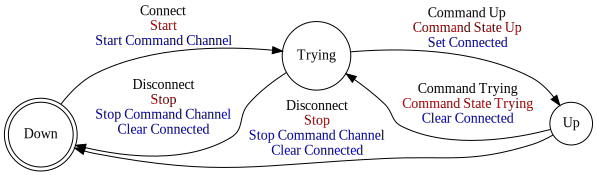

[//]: # (This file was autogenerated by docgen.gsl. Editing this file will result in loss of data.)
# Command Protocol

The Command protocol can be used to send commands to the CNC stack
of a running Machinekit instance.

## Messages
<a name="msg_emc_task_abort" />
### EMC TASK ABORT

Aborts the command currently executed by task.

#### Data Fields
* Each [Container](../machinetalk-protobuf.md#pb.Container) message MUST carry one [interp_name](../machinetalk-protobuf.md#pb.Container.interp_name) field.
* Each [Container](../machinetalk-protobuf.md#pb.Container) message MAY carry one [ticket](../machinetalk-protobuf.md#pb.Container.ticket) field.

#### Possible Responses
* [EMCCMD EXECUTED](#msg_emccmd_executed)
* [EMCCMD COMPLETED](#msg_emccmd_completed)
* [ERROR](#msg_error)

<a name="msg_emc_task_plan_run" />
### EMC TASK PLAN RUN

Run the task planner from the specified line number.

#### Data Fields
* Each [Container](../machinetalk-protobuf.md#pb.Container) message MUST carry one [EmcCommandParameters](../machinetalk-protobuf.md#pb.EmcCommandParameters) message.  
  * Each [EmcCommandParameters](../machinetalk-protobuf.md#pb.EmcCommandParameters) message MUST carry one [line number](../machinetalk-protobuf.md#pb.EmcCommandParameters.line number) field.
* Each [Container](../machinetalk-protobuf.md#pb.Container) message MUST carry one [interp_name](../machinetalk-protobuf.md#pb.Container.interp_name) field.
* Each [Container](../machinetalk-protobuf.md#pb.Container) message MAY carry one [ticket](../machinetalk-protobuf.md#pb.Container.ticket) field.

#### Possible Responses
* [EMCCMD EXECUTED](#msg_emccmd_executed)
* [EMCCMD COMPLETED](#msg_emccmd_completed)
* [ERROR](#msg_error)

<a name="msg_emc_task_plan_pause" />
### EMC TASK PLAN PAUSE

Pause the task planner at the current position.

#### Data Fields
* Each [Container](../machinetalk-protobuf.md#pb.Container) message MUST carry one [interp_name](../machinetalk-protobuf.md#pb.Container.interp_name) field.
* Each [Container](../machinetalk-protobuf.md#pb.Container) message MAY carry one [ticket](../machinetalk-protobuf.md#pb.Container.ticket) field.

#### Possible Responses
* [EMCCMD EXECUTED](#msg_emccmd_executed)
* [EMCCMD COMPLETED](#msg_emccmd_completed)
* [ERROR](#msg_error)

<a name="msg_emc_task_plan_step" />
### EMC TASK PLAN STEP

Step the task planner at the current position.

#### Data Fields
* Each [Container](../machinetalk-protobuf.md#pb.Container) message MUST carry one [interp_name](../machinetalk-protobuf.md#pb.Container.interp_name) field.
* Each [Container](../machinetalk-protobuf.md#pb.Container) message MAY carry one [ticket](../machinetalk-protobuf.md#pb.Container.ticket) field.

#### Possible Responses
* [EMCCMD EXECUTED](#msg_emccmd_executed)
* [EMCCMD COMPLETED](#msg_emccmd_completed)
* [ERROR](#msg_error)

<a name="msg_emc_task_plan_resume" />
### EMC TASK PLAN RESUME

Resume a pause program.

#### Data Fields
* Each [Container](../machinetalk-protobuf.md#pb.Container) message MUST carry one [interp_name](../machinetalk-protobuf.md#pb.Container.interp_name) field.
* Each [Container](../machinetalk-protobuf.md#pb.Container) message MAY carry one [ticket](../machinetalk-protobuf.md#pb.Container.ticket) field.

#### Possible Responses
* [EMCCMD EXECUTED](#msg_emccmd_executed)
* [EMCCMD COMPLETED](#msg_emccmd_completed)
* [ERROR](#msg_error)

<a name="msg_emc_spindle_brake_engage" />
### EMC SPINDLE BRAKE ENGAGE

Engage the spindle brake.

#### Data Fields
* Each [Container](../machinetalk-protobuf.md#pb.Container) message MAY carry one [ticket](../machinetalk-protobuf.md#pb.Container.ticket) field.

#### Possible Responses
* [EMCCMD EXECUTED](#msg_emccmd_executed)
* [EMCCMD COMPLETED](#msg_emccmd_completed)
* [ERROR](#msg_error)

<a name="msg_emc_spindle_brake_release" />
### EMC SPINDLE BRAKE RELEASE

Release the spindle brake.

#### Data Fields
* Each [Container](../machinetalk-protobuf.md#pb.Container) message MAY carry one [ticket](../machinetalk-protobuf.md#pb.Container.ticket) field.

#### Possible Responses
* [EMCCMD EXECUTED](#msg_emccmd_executed)
* [EMCCMD COMPLETED](#msg_emccmd_completed)
* [ERROR](#msg_error)

<a name="msg_emc_set_debug" />
### EMC SET DEBUG

Set the debug level of the CNC stack.

#### Data Fields
* Each [Container](../machinetalk-protobuf.md#pb.Container) message MUST carry one [EmcCommandParameters](../machinetalk-protobuf.md#pb.EmcCommandParameters) message.  
  * Each [EmcCommandParameters](../machinetalk-protobuf.md#pb.EmcCommandParameters) message MUST carry one [debug_level](../machinetalk-protobuf.md#pb.EmcCommandParameters.debug_level) field.
* Each [Container](../machinetalk-protobuf.md#pb.Container) message MAY carry one [ticket](../machinetalk-protobuf.md#pb.Container.ticket) field.

#### Possible Responses
* [EMCCMD EXECUTED](#msg_emccmd_executed)
* [EMCCMD COMPLETED](#msg_emccmd_completed)
* [ERROR](#msg_error)

<a name="msg_emc_traj_set_scale" />
### EMC TRAJ SET SCALE

Set the scale for the trajectory also known as feed override.

#### Data Fields
* Each [Container](../machinetalk-protobuf.md#pb.Container) message MUST carry one [EmcCommandParameters](../machinetalk-protobuf.md#pb.EmcCommandParameters) message.  
  * Each [EmcCommandParameters](../machinetalk-protobuf.md#pb.EmcCommandParameters) message MUST carry one [scale](../machinetalk-protobuf.md#pb.EmcCommandParameters.scale) field.
* Each [Container](../machinetalk-protobuf.md#pb.Container) message MAY carry one [ticket](../machinetalk-protobuf.md#pb.Container.ticket) field.

#### Possible Responses
* [EMCCMD EXECUTED](#msg_emccmd_executed)
* [EMCCMD COMPLETED](#msg_emccmd_completed)
* [ERROR](#msg_error)

<a name="msg_emc_coolant_flood_on" />
### EMC COOLANT FLOOD ON

Enable the coolant flood.

#### Data Fields
* Each [Container](../machinetalk-protobuf.md#pb.Container) message MAY carry one [ticket](../machinetalk-protobuf.md#pb.Container.ticket) field.

#### Possible Responses
* [EMCCMD EXECUTED](#msg_emccmd_executed)
* [EMCCMD COMPLETED](#msg_emccmd_completed)
* [ERROR](#msg_error)

<a name="msg_emc_coolant_flood_off" />
### EMC COOLANT FLOOD OFF

Disable the coolant flood.

#### Data Fields
* Each [Container](../machinetalk-protobuf.md#pb.Container) message MAY carry one [ticket](../machinetalk-protobuf.md#pb.Container.ticket) field.

#### Possible Responses
* [EMCCMD EXECUTED](#msg_emccmd_executed)
* [EMCCMD COMPLETED](#msg_emccmd_completed)
* [ERROR](#msg_error)

<a name="msg_emc_axis_home" />
### EMC AXIS HOME

Home the specified axis.

#### Data Fields
* Each [Container](../machinetalk-protobuf.md#pb.Container) message MUST carry one [EmcCommandParameters](../machinetalk-protobuf.md#pb.EmcCommandParameters) message.  
  * Each [EmcCommandParameters](../machinetalk-protobuf.md#pb.EmcCommandParameters) message MUST carry one [index](../machinetalk-protobuf.md#pb.EmcCommandParameters.index) field.
* Each [Container](../machinetalk-protobuf.md#pb.Container) message MAY carry one [ticket](../machinetalk-protobuf.md#pb.Container.ticket) field.

#### Possible Responses
* [EMCCMD EXECUTED](#msg_emccmd_executed)
* [EMCCMD COMPLETED](#msg_emccmd_completed)
* [ERROR](#msg_error)

<a name="msg_emc_axis_jog" />
### EMC AXIS JOG

Starts a continious jog movement.

#### Data Fields
* Each [Container](../machinetalk-protobuf.md#pb.Container) message MUST carry one [EmcCommandParameters](../machinetalk-protobuf.md#pb.EmcCommandParameters) message.  
  * Each [EmcCommandParameters](../machinetalk-protobuf.md#pb.EmcCommandParameters) message MUST carry one [index](../machinetalk-protobuf.md#pb.EmcCommandParameters.index) field.
* Each [Container](../machinetalk-protobuf.md#pb.Container) message MAY carry one [ticket](../machinetalk-protobuf.md#pb.Container.ticket) field.

#### Possible Responses
* [EMCCMD EXECUTED](#msg_emccmd_executed)
* [EMCCMD COMPLETED](#msg_emccmd_completed)
* [ERROR](#msg_error)

<a name="msg_emc_axis_abort" />
### EMC AXIS ABORT

Aborts a continuous jog movement.

#### Data Fields
* Each [Container](../machinetalk-protobuf.md#pb.Container) message MUST carry one [EmcCommandParameters](../machinetalk-protobuf.md#pb.EmcCommandParameters) message.  
  * Each [EmcCommandParameters](../machinetalk-protobuf.md#pb.EmcCommandParameters) message MUST carry one [index](../machinetalk-protobuf.md#pb.EmcCommandParameters.index) field.
* Each [Container](../machinetalk-protobuf.md#pb.Container) message MAY carry one [ticket](../machinetalk-protobuf.md#pb.Container.ticket) field.

#### Possible Responses
* [EMCCMD EXECUTED](#msg_emccmd_executed)
* [EMCCMD COMPLETED](#msg_emccmd_completed)
* [ERROR](#msg_error)

<a name="msg_emc_axis_incr_jog" />
### EMC AXIS INCR JOG

Starts a incremental jog movement.

#### Data Fields
* Each [Container](../machinetalk-protobuf.md#pb.Container) message MUST carry one [EmcCommandParameters](../machinetalk-protobuf.md#pb.EmcCommandParameters) message.  
  * Each [EmcCommandParameters](../machinetalk-protobuf.md#pb.EmcCommandParameters) message MUST carry one [index](../machinetalk-protobuf.md#pb.EmcCommandParameters.index) field.
* Each [Container](../machinetalk-protobuf.md#pb.Container) message MAY carry one [ticket](../machinetalk-protobuf.md#pb.Container.ticket) field.

#### Possible Responses
* [EMCCMD EXECUTED](#msg_emccmd_executed)
* [EMCCMD COMPLETED](#msg_emccmd_completed)
* [ERROR](#msg_error)

<a name="msg_emc_tool_load_tool_table" />
### EMC TOOL LOAD TOOL TABLE

(Re)Loads the tool table.

#### Data Fields
* Each [Container](../machinetalk-protobuf.md#pb.Container) message MAY carry one [ticket](../machinetalk-protobuf.md#pb.Container.ticket) field.

#### Possible Responses
* [EMCCMD EXECUTED](#msg_emccmd_executed)
* [EMCCMD COMPLETED](#msg_emccmd_completed)
* [ERROR](#msg_error)

<a name="msg_emc_traj_set_max_velocity" />
### EMC TRAJ SET MAX VELOCITY

Sets the maximum trajectory velocity.

#### Data Fields
* Each [Container](../machinetalk-protobuf.md#pb.Container) message MUST carry one [EmcCommandParameters](../machinetalk-protobuf.md#pb.EmcCommandParameters) message.  
  * Each [EmcCommandParameters](../machinetalk-protobuf.md#pb.EmcCommandParameters) message MUST carry one [velocity](../machinetalk-protobuf.md#pb.EmcCommandParameters.velocity) field.
* Each [Container](../machinetalk-protobuf.md#pb.Container) message MAY carry one [ticket](../machinetalk-protobuf.md#pb.Container.ticket) field.

#### Possible Responses
* [EMCCMD EXECUTED](#msg_emccmd_executed)
* [EMCCMD COMPLETED](#msg_emccmd_completed)
* [ERROR](#msg_error)

<a name="msg_emc_task_plan_execute" />
### EMC TASK PLAN EXECUTE

Execute a MDI command on the task planner.

#### Data Fields
* Each [Container](../machinetalk-protobuf.md#pb.Container) message MUST carry one [EmcCommandParameters](../machinetalk-protobuf.md#pb.EmcCommandParameters) message.  
  * Each [EmcCommandParameters](../machinetalk-protobuf.md#pb.EmcCommandParameters) message MUST carry one [command](../machinetalk-protobuf.md#pb.EmcCommandParameters.command) field.
* Each [Container](../machinetalk-protobuf.md#pb.Container) message MUST carry one [interp_name](../machinetalk-protobuf.md#pb.Container.interp_name) field.
* Each [Container](../machinetalk-protobuf.md#pb.Container) message MAY carry one [ticket](../machinetalk-protobuf.md#pb.Container.ticket) field.

#### Possible Responses
* [EMCCMD EXECUTED](#msg_emccmd_executed)
* [EMCCMD COMPLETED](#msg_emccmd_completed)
* [ERROR](#msg_error)

<a name="msg_emc_coolant_mist_on" />
### EMC COOLANT MIST ON

Turn the coolant mist on.

#### Data Fields
* Each [Container](../machinetalk-protobuf.md#pb.Container) message MAY carry one [ticket](../machinetalk-protobuf.md#pb.Container.ticket) field.

#### Possible Responses
* [EMCCMD EXECUTED](#msg_emccmd_executed)
* [EMCCMD COMPLETED](#msg_emccmd_completed)
* [ERROR](#msg_error)

<a name="msg_emc_coolant_mist_off" />
### EMC COOLANT MIST OFF

Turn the coolant mist off.

#### Data Fields
* Each [Container](../machinetalk-protobuf.md#pb.Container) message MAY carry one [ticket](../machinetalk-protobuf.md#pb.Container.ticket) field.

#### Possible Responses
* [EMCCMD EXECUTED](#msg_emccmd_executed)
* [EMCCMD COMPLETED](#msg_emccmd_completed)
* [ERROR](#msg_error)

<a name="msg_emc_task_plan_init" />
### EMC TASK PLAN INIT

Resets the RS274NGC interpreter.

#### Data Fields
* Each [Container](../machinetalk-protobuf.md#pb.Container) message MUST carry one [interp_name](../machinetalk-protobuf.md#pb.Container.interp_name) field.
* Each [Container](../machinetalk-protobuf.md#pb.Container) message MAY carry one [ticket](../machinetalk-protobuf.md#pb.Container.ticket) field.

#### Possible Responses
* [EMCCMD EXECUTED](#msg_emccmd_executed)
* [EMCCMD COMPLETED](#msg_emccmd_completed)
* [ERROR](#msg_error)

<a name="msg_emc_task_plan_open" />
### EMC TASK PLAN OPEN

Opens an NGC file on the task planner.

#### Data Fields
* Each [Container](../machinetalk-protobuf.md#pb.Container) message MUST carry one [EmcCommandParameters](../machinetalk-protobuf.md#pb.EmcCommandParameters) message.  
  * Each [EmcCommandParameters](../machinetalk-protobuf.md#pb.EmcCommandParameters) message MUST carry one [path](../machinetalk-protobuf.md#pb.EmcCommandParameters.path) field.
* Each [Container](../machinetalk-protobuf.md#pb.Container) message MUST carry one [interp_name](../machinetalk-protobuf.md#pb.Container.interp_name) field.
* Each [Container](../machinetalk-protobuf.md#pb.Container) message MAY carry one [ticket](../machinetalk-protobuf.md#pb.Container.ticket) field.

#### Possible Responses
* [EMCCMD EXECUTED](#msg_emccmd_executed)
* [EMCCMD COMPLETED](#msg_emccmd_completed)
* [ERROR](#msg_error)

<a name="msg_emc_task_plan_set_block_delete" />
### EMC TASK PLAN SET BLOCK DELETE

Sets block delete flag.

#### Data Fields
* Each [Container](../machinetalk-protobuf.md#pb.Container) message MUST carry one [EmcCommandParameters](../machinetalk-protobuf.md#pb.EmcCommandParameters) message.  
  * Each [EmcCommandParameters](../machinetalk-protobuf.md#pb.EmcCommandParameters) message MUST carry one [enable](../machinetalk-protobuf.md#pb.EmcCommandParameters.enable) field.
* Each [Container](../machinetalk-protobuf.md#pb.Container) message MAY carry one [ticket](../machinetalk-protobuf.md#pb.Container.ticket) field.

#### Possible Responses
* [EMCCMD EXECUTED](#msg_emccmd_executed)
* [EMCCMD COMPLETED](#msg_emccmd_completed)
* [ERROR](#msg_error)

<a name="msg_emc_task_plan_set_optional_stop" />
### EMC TASK PLAN SET OPTIONAL STOP

Sets optional stop on/off.

#### Data Fields
* Each [Container](../machinetalk-protobuf.md#pb.Container) message MUST carry one [EmcCommandParameters](../machinetalk-protobuf.md#pb.EmcCommandParameters) message.  
  * Each [EmcCommandParameters](../machinetalk-protobuf.md#pb.EmcCommandParameters) message MUST carry one [enable](../machinetalk-protobuf.md#pb.EmcCommandParameters.enable) field.
* Each [Container](../machinetalk-protobuf.md#pb.Container) message MAY carry one [ticket](../machinetalk-protobuf.md#pb.Container.ticket) field.

#### Possible Responses
* [EMCCMD EXECUTED](#msg_emccmd_executed)
* [EMCCMD COMPLETED](#msg_emccmd_completed)
* [ERROR](#msg_error)

<a name="msg_emc_task_set_mode" />
### EMC TASK SET MODE

Set mode (MODE_MDI, MODE_MANUAL, MODE_AUTO).

#### Data Fields
* Each [Container](../machinetalk-protobuf.md#pb.Container) message MUST carry one [EmcCommandParameters](../machinetalk-protobuf.md#pb.EmcCommandParameters) message.  
  * Each [EmcCommandParameters](../machinetalk-protobuf.md#pb.EmcCommandParameters) message MUST carry one [task_mode](../machinetalk-protobuf.md#pb.EmcCommandParameters.task_mode) field.
* Each [Container](../machinetalk-protobuf.md#pb.Container) message MUST carry one [interp_name](../machinetalk-protobuf.md#pb.Container.interp_name) field.
* Each [Container](../machinetalk-protobuf.md#pb.Container) message MAY carry one [ticket](../machinetalk-protobuf.md#pb.Container.ticket) field.

#### Possible Responses
* [EMCCMD EXECUTED](#msg_emccmd_executed)
* [EMCCMD COMPLETED](#msg_emccmd_completed)
* [ERROR](#msg_error)

<a name="msg_emc_task_set_state" />
### EMC TASK SET STATE

Sets the machine state. Machine state should be STATE_ESTOP, STATE_ESTOP_RESET, STATE_ON or STATE_OFF.

#### Data Fields
* Each [Container](../machinetalk-protobuf.md#pb.Container) message MUST carry one [EmcCommandParameters](../machinetalk-protobuf.md#pb.EmcCommandParameters) message.  
  * Each [EmcCommandParameters](../machinetalk-protobuf.md#pb.EmcCommandParameters) message MUST carry one [task_state](../machinetalk-protobuf.md#pb.EmcCommandParameters.task_state) field.
* Each [Container](../machinetalk-protobuf.md#pb.Container) message MUST carry one [interp_name](../machinetalk-protobuf.md#pb.Container.interp_name) field.
* Each [Container](../machinetalk-protobuf.md#pb.Container) message MAY carry one [ticket](../machinetalk-protobuf.md#pb.Container.ticket) field.

#### Possible Responses
* [EMCCMD EXECUTED](#msg_emccmd_executed)
* [EMCCMD COMPLETED](#msg_emccmd_completed)
* [ERROR](#msg_error)

<a name="msg_emc_task_traj_set_so_enable" />
### EMC TASK TRAJ SET SO ENABLE

Sets spindle override flag.

#### Data Fields
* Each [Container](../machinetalk-protobuf.md#pb.Container) message MUST carry one [EmcCommandParameters](../machinetalk-protobuf.md#pb.EmcCommandParameters) message.  
  * Each [EmcCommandParameters](../machinetalk-protobuf.md#pb.EmcCommandParameters) message MUST carry one [enable](../machinetalk-protobuf.md#pb.EmcCommandParameters.enable) field.
* Each [Container](../machinetalk-protobuf.md#pb.Container) message MAY carry one [ticket](../machinetalk-protobuf.md#pb.Container.ticket) field.

#### Possible Responses
* [EMCCMD EXECUTED](#msg_emccmd_executed)
* [EMCCMD COMPLETED](#msg_emccmd_completed)
* [ERROR](#msg_error)

<a name="msg_emc_traj_set_fh_enable" />
### EMC TRAJ SET FH ENABLE

Sets feed hold on/off.

#### Data Fields
* Each [Container](../machinetalk-protobuf.md#pb.Container) message MUST carry one [EmcCommandParameters](../machinetalk-protobuf.md#pb.EmcCommandParameters) message.  
  * Each [EmcCommandParameters](../machinetalk-protobuf.md#pb.EmcCommandParameters) message MUST carry one [enable](../machinetalk-protobuf.md#pb.EmcCommandParameters.enable) field.
* Each [Container](../machinetalk-protobuf.md#pb.Container) message MAY carry one [ticket](../machinetalk-protobuf.md#pb.Container.ticket) field.

#### Possible Responses
* [EMCCMD EXECUTED](#msg_emccmd_executed)
* [EMCCMD COMPLETED](#msg_emccmd_completed)
* [ERROR](#msg_error)

<a name="msg_emc_traj_set_fo_enable" />
### EMC TRAJ SET FO ENABLE

Sets feed override on/off.

#### Data Fields
* Each [Container](../machinetalk-protobuf.md#pb.Container) message MUST carry one [EmcCommandParameters](../machinetalk-protobuf.md#pb.EmcCommandParameters) message.  
  * Each [EmcCommandParameters](../machinetalk-protobuf.md#pb.EmcCommandParameters) message MUST carry one [enable](../machinetalk-protobuf.md#pb.EmcCommandParameters.enable) field.
* Each [Container](../machinetalk-protobuf.md#pb.Container) message MAY carry one [ticket](../machinetalk-protobuf.md#pb.Container.ticket) field.

#### Possible Responses
* [EMCCMD EXECUTED](#msg_emccmd_executed)
* [EMCCMD COMPLETED](#msg_emccmd_completed)
* [ERROR](#msg_error)

<a name="msg_emc_traj_set_max_velocity" />
### EMC TRAJ SET MAX VELOCITY

Sets maximum velocity.

#### Data Fields
* Each [Container](../machinetalk-protobuf.md#pb.Container) message MUST carry one [EmcCommandParameters](../machinetalk-protobuf.md#pb.EmcCommandParameters) message.  
  * Each [EmcCommandParameters](../machinetalk-protobuf.md#pb.EmcCommandParameters) message MUST carry one [velocity](../machinetalk-protobuf.md#pb.EmcCommandParameters.velocity) field.
* Each [Container](../machinetalk-protobuf.md#pb.Container) message MAY carry one [ticket](../machinetalk-protobuf.md#pb.Container.ticket) field.

#### Possible Responses
* [EMCCMD EXECUTED](#msg_emccmd_executed)
* [EMCCMD COMPLETED](#msg_emccmd_completed)
* [ERROR](#msg_error)

<a name="msg_emc_traj_set_mode" />
### EMC TRAJ SET MODE

Sets trajectory mode. Mode is one of MODE_FREE, MODE_COORD or MODE_TELEOP.

#### Data Fields
* Each [Container](../machinetalk-protobuf.md#pb.Container) message MUST carry one [EmcCommandParameters](../machinetalk-protobuf.md#pb.EmcCommandParameters) message.  
  * Each [EmcCommandParameters](../machinetalk-protobuf.md#pb.EmcCommandParameters) message MUST carry one [traj_mode](../machinetalk-protobuf.md#pb.EmcCommandParameters.traj_mode) field.
* Each [Container](../machinetalk-protobuf.md#pb.Container) message MAY carry one [ticket](../machinetalk-protobuf.md#pb.Container.ticket) field.

#### Possible Responses
* [EMCCMD EXECUTED](#msg_emccmd_executed)
* [EMCCMD COMPLETED](#msg_emccmd_completed)
* [ERROR](#msg_error)

<a name="msg_emc_traj_set_scale" />
### EMC TRAJ SET SCALE

Sets the feedrate.

#### Data Fields
* Each [Container](../machinetalk-protobuf.md#pb.Container) message MUST carry one [EmcCommandParameters](../machinetalk-protobuf.md#pb.EmcCommandParameters) message.  
  * Each [EmcCommandParameters](../machinetalk-protobuf.md#pb.EmcCommandParameters) message MUST carry one [scale](../machinetalk-protobuf.md#pb.EmcCommandParameters.scale) field.
* Each [Container](../machinetalk-protobuf.md#pb.Container) message MAY carry one [ticket](../machinetalk-protobuf.md#pb.Container.ticket) field.

#### Possible Responses
* [EMCCMD EXECUTED](#msg_emccmd_executed)
* [EMCCMD COMPLETED](#msg_emccmd_completed)
* [ERROR](#msg_error)

<a name="msg_emc_traj_set_spindle_scale" />
### EMC TRAJ SET SPINDLE SCALE

Sets spindle override factor.

#### Data Fields
* Each [Container](../machinetalk-protobuf.md#pb.Container) message MUST carry one [EmcCommandParameters](../machinetalk-protobuf.md#pb.EmcCommandParameters) message.  
  * Each [EmcCommandParameters](../machinetalk-protobuf.md#pb.EmcCommandParameters) message MUST carry one [scale](../machinetalk-protobuf.md#pb.EmcCommandParameters.scale) field.
* Each [Container](../machinetalk-protobuf.md#pb.Container) message MAY carry one [ticket](../machinetalk-protobuf.md#pb.Container.ticket) field.

#### Possible Responses
* [EMCCMD EXECUTED](#msg_emccmd_executed)
* [EMCCMD COMPLETED](#msg_emccmd_completed)
* [ERROR](#msg_error)

<a name="msg_emc_traj_set_teleop_enable" />
### EMC TRAJ SET TELEOP ENABLE

Enable/disable teleop mode.

#### Data Fields
* Each [Container](../machinetalk-protobuf.md#pb.Container) message MUST carry one [EmcCommandParameters](../machinetalk-protobuf.md#pb.EmcCommandParameters) message.  
  * Each [EmcCommandParameters](../machinetalk-protobuf.md#pb.EmcCommandParameters) message MUST carry one [enable](../machinetalk-protobuf.md#pb.EmcCommandParameters.enable) field.
* Each [Container](../machinetalk-protobuf.md#pb.Container) message MAY carry one [ticket](../machinetalk-protobuf.md#pb.Container.ticket) field.

#### Possible Responses
* [EMCCMD EXECUTED](#msg_emccmd_executed)
* [EMCCMD COMPLETED](#msg_emccmd_completed)
* [ERROR](#msg_error)

<a name="msg_emc_traj_set_teleop_vector" />
### EMC TRAJ SET TELEOP VECTOR

Sets teleop destination vector.

#### Data Fields
* Each [Container](../machinetalk-protobuf.md#pb.Container) message MUST carry one [EmcCommandParameters](../machinetalk-protobuf.md#pb.EmcCommandParameters) message.  
  * Each [EmcCommandParameters](../machinetalk-protobuf.md#pb.EmcCommandParameters) message MUST carry one [Pose](../machinetalk-protobuf.md#pb.Pose) message.    
    * Each [Pose](../machinetalk-protobuf.md#pb.Pose) message MUST carry one [a](../machinetalk-protobuf.md#pb.Pose.a) field.
    * Each [Pose](../machinetalk-protobuf.md#pb.Pose) message MUST carry one [b](../machinetalk-protobuf.md#pb.Pose.b) field.
    * Each [Pose](../machinetalk-protobuf.md#pb.Pose) message MUST carry one [c](../machinetalk-protobuf.md#pb.Pose.c) field.
    * Each [Pose](../machinetalk-protobuf.md#pb.Pose) message MAY carry one [u](../machinetalk-protobuf.md#pb.Pose.u) field.
    * Each [Pose](../machinetalk-protobuf.md#pb.Pose) message MAY carry one [v](../machinetalk-protobuf.md#pb.Pose.v) field.
    * Each [Pose](../machinetalk-protobuf.md#pb.Pose) message MAY carry one [w](../machinetalk-protobuf.md#pb.Pose.w) field.
* Each [Container](../machinetalk-protobuf.md#pb.Container) message MAY carry one [ticket](../machinetalk-protobuf.md#pb.Container.ticket) field.

#### Possible Responses
* [EMCCMD EXECUTED](#msg_emccmd_executed)
* [EMCCMD COMPLETED](#msg_emccmd_completed)
* [ERROR](#msg_error)

<a name="msg_emc_tool_set_offset" />
### EMC TOOL SET OFFSET

Sets the tool offset.

#### Data Fields
* Each [Container](../machinetalk-protobuf.md#pb.Container) message MUST carry one [EmcCommandParameters](../machinetalk-protobuf.md#pb.EmcCommandParameters) message.  
  * Each [EmcCommandParameters](../machinetalk-protobuf.md#pb.EmcCommandParameters) message MUST carry one [ToolData](../machinetalk-protobuf.md#pb.ToolData) message.  
    * Each [ToolData](../machinetalk-protobuf.md#pb.ToolData) message MUST carry one [index](../machinetalk-protobuf.md#pb.ToolData.index) field.
    * Each [ToolData](../machinetalk-protobuf.md#pb.ToolData) message MUST carry one [zOffset](../machinetalk-protobuf.md#pb.ToolData.zOffset) field.
    * Each [ToolData](../machinetalk-protobuf.md#pb.ToolData) message MUST carry one [xOffset](../machinetalk-protobuf.md#pb.ToolData.xOffset) field.
    * Each [ToolData](../machinetalk-protobuf.md#pb.ToolData) message MUST carry one [diameter](../machinetalk-protobuf.md#pb.ToolData.diameter) field.
    * Each [ToolData](../machinetalk-protobuf.md#pb.ToolData) message MUST carry one [frontangle](../machinetalk-protobuf.md#pb.ToolData.frontangle) field.
    * Each [ToolData](../machinetalk-protobuf.md#pb.ToolData) message MUST carry one [backangle](../machinetalk-protobuf.md#pb.ToolData.backangle) field.
    * Each [ToolData](../machinetalk-protobuf.md#pb.ToolData) message MUST carry one [orientation](../machinetalk-protobuf.md#pb.ToolData.orientation) field.
* Each [Container](../machinetalk-protobuf.md#pb.Container) message MAY carry one [ticket](../machinetalk-protobuf.md#pb.Container.ticket) field.

#### Possible Responses
* [EMCCMD EXECUTED](#msg_emccmd_executed)
* [EMCCMD COMPLETED](#msg_emccmd_completed)
* [ERROR](#msg_error)

<a name="msg_emc_axis_override_limits" />
### EMC AXIS OVERRIDE LIMITS

Sets the override axis limits flag.

#### Data Fields
* Each [Container](../machinetalk-protobuf.md#pb.Container) message MAY carry one [ticket](../machinetalk-protobuf.md#pb.Container.ticket) field.

#### Possible Responses
* [EMCCMD EXECUTED](#msg_emccmd_executed)
* [EMCCMD COMPLETED](#msg_emccmd_completed)
* [ERROR](#msg_error)

<a name="msg_emc_spindle_constant" />
### EMC SPINDLE CONSTANT

Sets spindle direction to SPINDLE_CONSTANT.

#### Data Fields
* Each [Container](../machinetalk-protobuf.md#pb.Container) message MAY carry one [ticket](../machinetalk-protobuf.md#pb.Container.ticket) field.

#### Possible Responses
* [EMCCMD EXECUTED](#msg_emccmd_executed)
* [EMCCMD COMPLETED](#msg_emccmd_completed)
* [ERROR](#msg_error)

<a name="msg_emc_spindle_decrease" />
### EMC SPINDLE DECREASE

Sets spindle direction to SPINDLE_DECREASE.

#### Data Fields
* Each [Container](../machinetalk-protobuf.md#pb.Container) message MAY carry one [ticket](../machinetalk-protobuf.md#pb.Container.ticket) field.

#### Possible Responses
* [EMCCMD EXECUTED](#msg_emccmd_executed)
* [EMCCMD COMPLETED](#msg_emccmd_completed)
* [ERROR](#msg_error)

<a name="msg_emc_spindle_increase" />
### EMC SPINDLE INCREASE

Sets spindle direction to SPINDLE_INCREASE.

#### Data Fields
* Each [Container](../machinetalk-protobuf.md#pb.Container) message MAY carry one [ticket](../machinetalk-protobuf.md#pb.Container.ticket) field.

#### Possible Responses
* [EMCCMD EXECUTED](#msg_emccmd_executed)
* [EMCCMD COMPLETED](#msg_emccmd_completed)
* [ERROR](#msg_error)

<a name="msg_emc_spindle_off" />
### EMC SPINDLE OFF

Sets spindle direction to SPINDLE_OFF.

#### Data Fields
* Each [Container](../machinetalk-protobuf.md#pb.Container) message MAY carry one [ticket](../machinetalk-protobuf.md#pb.Container.ticket) field.

#### Possible Responses
* [EMCCMD EXECUTED](#msg_emccmd_executed)
* [EMCCMD COMPLETED](#msg_emccmd_completed)
* [ERROR](#msg_error)

<a name="msg_emc_spindle_on" />
### EMC SPINDLE ON

Sets spindle direction to SPINDLE_FORWARD and changes spindle
speed if velocity is not set to 0.

#### Data Fields
* Each [Container](../machinetalk-protobuf.md#pb.Container) message MUST carry one [EmcCommandParameters](../machinetalk-protobuf.md#pb.EmcCommandParameters) message.  
  * Each [EmcCommandParameters](../machinetalk-protobuf.md#pb.EmcCommandParameters) message MUST carry one [velocity](../machinetalk-protobuf.md#pb.EmcCommandParameters.velocity) field.
* Each [Container](../machinetalk-protobuf.md#pb.Container) message MAY carry one [ticket](../machinetalk-protobuf.md#pb.Container.ticket) field.

#### Possible Responses
* [EMCCMD EXECUTED](#msg_emccmd_executed)
* [EMCCMD COMPLETED](#msg_emccmd_completed)
* [ERROR](#msg_error)

<a name="msg_emc_spindle_brake_engage" />
### EMC SPINDLE BRAKE ENGAGE

Engage spindle brake.

#### Data Fields
* Each [Container](../machinetalk-protobuf.md#pb.Container) message MAY carry one [ticket](../machinetalk-protobuf.md#pb.Container.ticket) field.

#### Possible Responses
* [EMCCMD EXECUTED](#msg_emccmd_executed)
* [EMCCMD COMPLETED](#msg_emccmd_completed)
* [ERROR](#msg_error)

<a name="msg_emc_spindle_brake_release" />
### EMC SPINDLE BRAKE RELEASE

Release spindle brake.

#### Data Fields
* Each [Container](../machinetalk-protobuf.md#pb.Container) message MAY carry one [ticket](../machinetalk-protobuf.md#pb.Container.ticket) field.

#### Possible Responses
* [EMCCMD EXECUTED](#msg_emccmd_executed)
* [EMCCMD COMPLETED](#msg_emccmd_completed)
* [ERROR](#msg_error)

<a name="msg_emc_motion_set_aout" />
### EMC MOTION SET AOUT

Sets analog output pin to value.

#### Data Fields
* Each [Container](../machinetalk-protobuf.md#pb.Container) message MUST carry one [EmcCommandParameters](../machinetalk-protobuf.md#pb.EmcCommandParameters) message.  
  * Each [EmcCommandParameters](../machinetalk-protobuf.md#pb.EmcCommandParameters) message MUST carry one [index](../machinetalk-protobuf.md#pb.EmcCommandParameters.index) field.
  * Each [EmcCommandParameters](../machinetalk-protobuf.md#pb.EmcCommandParameters) message MUST carry one [value](../machinetalk-protobuf.md#pb.EmcCommandParameters.value) field.
* Each [Container](../machinetalk-protobuf.md#pb.Container) message MAY carry one [ticket](../machinetalk-protobuf.md#pb.Container.ticket) field.

#### Possible Responses
* [EMCCMD EXECUTED](#msg_emccmd_executed)
* [EMCCMD COMPLETED](#msg_emccmd_completed)
* [ERROR](#msg_error)

<a name="msg_emc_motion_set_dout" />
### EMC MOTION SET DOUT

Sets digital output pin to value.

#### Data Fields
* Each [Container](../machinetalk-protobuf.md#pb.Container) message MUST carry one [EmcCommandParameters](../machinetalk-protobuf.md#pb.EmcCommandParameters) message.  
  * Each [EmcCommandParameters](../machinetalk-protobuf.md#pb.EmcCommandParameters) message MUST carry one [index](../machinetalk-protobuf.md#pb.EmcCommandParameters.index) field.
  * Each [EmcCommandParameters](../machinetalk-protobuf.md#pb.EmcCommandParameters) message MUST carry one [enable](../machinetalk-protobuf.md#pb.EmcCommandParameters.enable) field.
* Each [Container](../machinetalk-protobuf.md#pb.Container) message MAY carry one [ticket](../machinetalk-protobuf.md#pb.Container.ticket) field.

#### Possible Responses
* [EMCCMD EXECUTED](#msg_emccmd_executed)
* [EMCCMD COMPLETED](#msg_emccmd_completed)
* [ERROR](#msg_error)

<a name="msg_emc_motion_adaptive" />
### EMC MOTION ADAPTIVE

Sets adaptive feed flag.

#### Data Fields
* Each [Container](../machinetalk-protobuf.md#pb.Container) message MUST carry one [EmcCommandParameters](../machinetalk-protobuf.md#pb.EmcCommandParameters) message.  
  * Each [EmcCommandParameters](../machinetalk-protobuf.md#pb.EmcCommandParameters) message MUST carry one [enable](../machinetalk-protobuf.md#pb.EmcCommandParameters.enable) field.
* Each [Container](../machinetalk-protobuf.md#pb.Container) message MAY carry one [ticket](../machinetalk-protobuf.md#pb.Container.ticket) field.

#### Possible Responses
* [EMCCMD EXECUTED](#msg_emccmd_executed)
* [EMCCMD COMPLETED](#msg_emccmd_completed)
* [ERROR](#msg_error)

<a name="msg_emc_axis_set_max_position_limit" />
### EMC AXIS SET MAX POSITION LIMIT

Sets max position limit for a given axis.

#### Data Fields
* Each [Container](../machinetalk-protobuf.md#pb.Container) message MUST carry one [EmcCommandParameters](../machinetalk-protobuf.md#pb.EmcCommandParameters) message.  
  * Each [EmcCommandParameters](../machinetalk-protobuf.md#pb.EmcCommandParameters) message MUST carry one [index](../machinetalk-protobuf.md#pb.EmcCommandParameters.index) field.
  * Each [EmcCommandParameters](../machinetalk-protobuf.md#pb.EmcCommandParameters) message MUST carry one [value](../machinetalk-protobuf.md#pb.EmcCommandParameters.value) field.
* Each [Container](../machinetalk-protobuf.md#pb.Container) message MAY carry one [ticket](../machinetalk-protobuf.md#pb.Container.ticket) field.

#### Possible Responses
* [EMCCMD EXECUTED](#msg_emccmd_executed)
* [EMCCMD COMPLETED](#msg_emccmd_completed)
* [ERROR](#msg_error)

<a name="msg_emc_axis_set_min_position_limit" />
### EMC AXIS SET MIN POSITION LIMIT

Sets min position limit for a given axis.

#### Data Fields
* Each [Container](../machinetalk-protobuf.md#pb.Container) message MUST carry one [EmcCommandParameters](../machinetalk-protobuf.md#pb.EmcCommandParameters) message.  
  * Each [EmcCommandParameters](../machinetalk-protobuf.md#pb.EmcCommandParameters) message MUST carry one [index](../machinetalk-protobuf.md#pb.EmcCommandParameters.index) field.
  * Each [EmcCommandParameters](../machinetalk-protobuf.md#pb.EmcCommandParameters) message MUST carry one [value](../machinetalk-protobuf.md#pb.EmcCommandParameters.value) field.
* Each [Container](../machinetalk-protobuf.md#pb.Container) message MAY carry one [ticket](../machinetalk-protobuf.md#pb.Container.ticket) field.

#### Possible Responses
* [EMCCMD EXECUTED](#msg_emccmd_executed)
* [EMCCMD COMPLETED](#msg_emccmd_completed)
* [ERROR](#msg_error)

<a name="msg_emc_axis_unhome" />
### EMC AXIS UNHOME

Unhome a given axis.

#### Data Fields
* Each [Container](../machinetalk-protobuf.md#pb.Container) message MUST carry one [EmcCommandParameters](../machinetalk-protobuf.md#pb.EmcCommandParameters) message.  
  * Each [EmcCommandParameters](../machinetalk-protobuf.md#pb.EmcCommandParameters) message MUST carry one [index](../machinetalk-protobuf.md#pb.EmcCommandParameters.index) field.
* Each [Container](../machinetalk-protobuf.md#pb.Container) message MAY carry one [ticket](../machinetalk-protobuf.md#pb.Container.ticket) field.

#### Possible Responses
* [EMCCMD EXECUTED](#msg_emccmd_executed)
* [EMCCMD COMPLETED](#msg_emccmd_completed)
* [ERROR](#msg_error)

<a name="msg_emccmd_executed" />
### EMCCMD EXECUTED

Response from server when command has been executed. Contains a
return ticket to indicate which command this belongs to.

#### Data Fields
* Each [Container](../machinetalk-protobuf.md#pb.Container) message MUST carry one [return_ticket](../machinetalk-protobuf.md#pb.Container.return_ticket) field.

#### Response to
* [EMC TASK ABORT](#msg_emc_task_abort)
* [EMC TASK PLAN RUN](#msg_emc_task_plan_run)
* [EMC TASK PLAN PAUSE](#msg_emc_task_plan_pause)
* [EMC TASK PLAN STEP](#msg_emc_task_plan_step)
* [EMC TASK PLAN RESUME](#msg_emc_task_plan_resume)
* [EMC SPINDLE BRAKE ENGAGE](#msg_emc_spindle_brake_engage)
* [EMC SPINDLE BRAKE RELEASE](#msg_emc_spindle_brake_release)
* [EMC SET DEBUG](#msg_emc_set_debug)
* [EMC TRAJ SET SCALE](#msg_emc_traj_set_scale)
* [EMC COOLANT FLOOD ON](#msg_emc_coolant_flood_on)
* [EMC COOLANT FLOOD OFF](#msg_emc_coolant_flood_off)
* [EMC AXIS HOME](#msg_emc_axis_home)
* [EMC AXIS JOG](#msg_emc_axis_jog)
* [EMC AXIS ABORT](#msg_emc_axis_abort)
* [EMC AXIS INCR JOG](#msg_emc_axis_incr_jog)
* [EMC TOOL LOAD TOOL TABLE](#msg_emc_tool_load_tool_table)
* [EMC TRAJ SET MAX VELOCITY](#msg_emc_traj_set_max_velocity)
* [EMC TASK PLAN EXECUTE](#msg_emc_task_plan_execute)
* [EMC COOLANT MIST ON](#msg_emc_coolant_mist_on)
* [EMC COOLANT MIST OFF](#msg_emc_coolant_mist_off)
* [EMC TASK PLAN INIT](#msg_emc_task_plan_init)
* [EMC TASK PLAN OPEN](#msg_emc_task_plan_open)
* [EMC TASK PLAN SET BLOCK DELETE](#msg_emc_task_plan_set_block_delete)
* [EMC TASK PLAN SET OPTIONAL STOP](#msg_emc_task_plan_set_optional_stop)
* [EMC TASK SET MODE](#msg_emc_task_set_mode)
* [EMC TASK SET STATE](#msg_emc_task_set_state)
* [EMC TASK TRAJ SET SO ENABLE](#msg_emc_task_traj_set_so_enable)
* [EMC TRAJ SET FH ENABLE](#msg_emc_traj_set_fh_enable)
* [EMC TRAJ SET FO ENABLE](#msg_emc_traj_set_fo_enable)
* [EMC TRAJ SET MAX VELOCITY](#msg_emc_traj_set_max_velocity)
* [EMC TRAJ SET MODE](#msg_emc_traj_set_mode)
* [EMC TRAJ SET SCALE](#msg_emc_traj_set_scale)
* [EMC TRAJ SET SPINDLE SCALE](#msg_emc_traj_set_spindle_scale)
* [EMC TRAJ SET TELEOP ENABLE](#msg_emc_traj_set_teleop_enable)
* [EMC TRAJ SET TELEOP VECTOR](#msg_emc_traj_set_teleop_vector)
* [EMC TOOL SET OFFSET](#msg_emc_tool_set_offset)
* [EMC AXIS OVERRIDE LIMITS](#msg_emc_axis_override_limits)
* [EMC SPINDLE CONSTANT](#msg_emc_spindle_constant)
* [EMC SPINDLE DECREASE](#msg_emc_spindle_decrease)
* [EMC SPINDLE INCREASE](#msg_emc_spindle_increase)
* [EMC SPINDLE OFF](#msg_emc_spindle_off)
* [EMC SPINDLE ON](#msg_emc_spindle_on)
* [EMC SPINDLE BRAKE ENGAGE](#msg_emc_spindle_brake_engage)
* [EMC SPINDLE BRAKE RELEASE](#msg_emc_spindle_brake_release)
* [EMC MOTION SET AOUT](#msg_emc_motion_set_aout)
* [EMC MOTION SET DOUT](#msg_emc_motion_set_dout)
* [EMC MOTION ADAPTIVE](#msg_emc_motion_adaptive)
* [EMC AXIS SET MAX POSITION LIMIT](#msg_emc_axis_set_max_position_limit)
* [EMC AXIS SET MIN POSITION LIMIT](#msg_emc_axis_set_min_position_limit)
* [EMC AXIS UNHOME](#msg_emc_axis_unhome)

<a name="msg_emccmd_completed" />
### EMCCMD COMPLETED

Response from server when command has been completed. Contains a
return ticket to indicate which command this belongs to.

#### Data Fields
* Each [Container](../machinetalk-protobuf.md#pb.Container) message MUST carry one [return_ticket](../machinetalk-protobuf.md#pb.Container.return_ticket) field.

#### Response to
* [EMC TASK ABORT](#msg_emc_task_abort)
* [EMC TASK PLAN RUN](#msg_emc_task_plan_run)
* [EMC TASK PLAN PAUSE](#msg_emc_task_plan_pause)
* [EMC TASK PLAN STEP](#msg_emc_task_plan_step)
* [EMC TASK PLAN RESUME](#msg_emc_task_plan_resume)
* [EMC SPINDLE BRAKE ENGAGE](#msg_emc_spindle_brake_engage)
* [EMC SPINDLE BRAKE RELEASE](#msg_emc_spindle_brake_release)
* [EMC SET DEBUG](#msg_emc_set_debug)
* [EMC TRAJ SET SCALE](#msg_emc_traj_set_scale)
* [EMC COOLANT FLOOD ON](#msg_emc_coolant_flood_on)
* [EMC COOLANT FLOOD OFF](#msg_emc_coolant_flood_off)
* [EMC AXIS HOME](#msg_emc_axis_home)
* [EMC AXIS JOG](#msg_emc_axis_jog)
* [EMC AXIS ABORT](#msg_emc_axis_abort)
* [EMC AXIS INCR JOG](#msg_emc_axis_incr_jog)
* [EMC TOOL LOAD TOOL TABLE](#msg_emc_tool_load_tool_table)
* [EMC TRAJ SET MAX VELOCITY](#msg_emc_traj_set_max_velocity)
* [EMC TASK PLAN EXECUTE](#msg_emc_task_plan_execute)
* [EMC COOLANT MIST ON](#msg_emc_coolant_mist_on)
* [EMC COOLANT MIST OFF](#msg_emc_coolant_mist_off)
* [EMC TASK PLAN INIT](#msg_emc_task_plan_init)
* [EMC TASK PLAN OPEN](#msg_emc_task_plan_open)
* [EMC TASK PLAN SET BLOCK DELETE](#msg_emc_task_plan_set_block_delete)
* [EMC TASK PLAN SET OPTIONAL STOP](#msg_emc_task_plan_set_optional_stop)
* [EMC TASK SET MODE](#msg_emc_task_set_mode)
* [EMC TASK SET STATE](#msg_emc_task_set_state)
* [EMC TASK TRAJ SET SO ENABLE](#msg_emc_task_traj_set_so_enable)
* [EMC TRAJ SET FH ENABLE](#msg_emc_traj_set_fh_enable)
* [EMC TRAJ SET FO ENABLE](#msg_emc_traj_set_fo_enable)
* [EMC TRAJ SET MAX VELOCITY](#msg_emc_traj_set_max_velocity)
* [EMC TRAJ SET MODE](#msg_emc_traj_set_mode)
* [EMC TRAJ SET SCALE](#msg_emc_traj_set_scale)
* [EMC TRAJ SET SPINDLE SCALE](#msg_emc_traj_set_spindle_scale)
* [EMC TRAJ SET TELEOP ENABLE](#msg_emc_traj_set_teleop_enable)
* [EMC TRAJ SET TELEOP VECTOR](#msg_emc_traj_set_teleop_vector)
* [EMC TOOL SET OFFSET](#msg_emc_tool_set_offset)
* [EMC AXIS OVERRIDE LIMITS](#msg_emc_axis_override_limits)
* [EMC SPINDLE CONSTANT](#msg_emc_spindle_constant)
* [EMC SPINDLE DECREASE](#msg_emc_spindle_decrease)
* [EMC SPINDLE INCREASE](#msg_emc_spindle_increase)
* [EMC SPINDLE OFF](#msg_emc_spindle_off)
* [EMC SPINDLE ON](#msg_emc_spindle_on)
* [EMC SPINDLE BRAKE ENGAGE](#msg_emc_spindle_brake_engage)
* [EMC SPINDLE BRAKE RELEASE](#msg_emc_spindle_brake_release)
* [EMC MOTION SET AOUT](#msg_emc_motion_set_aout)
* [EMC MOTION SET DOUT](#msg_emc_motion_set_dout)
* [EMC MOTION ADAPTIVE](#msg_emc_motion_adaptive)
* [EMC AXIS SET MAX POSITION LIMIT](#msg_emc_axis_set_max_position_limit)
* [EMC AXIS SET MIN POSITION LIMIT](#msg_emc_axis_set_min_position_limit)
* [EMC AXIS UNHOME](#msg_emc_axis_unhome)

<a name="msg_error" />
### ERROR

Response from server when command parameters are wrong.

#### Data Fields
* Each [Container](../machinetalk-protobuf.md#pb.Container) message MUST carry one or more [note](../machinetalk-protobuf.md#pb.Container.note) fields.

#### Response to
* [EMC TASK ABORT](#msg_emc_task_abort)
* [EMC TASK PLAN RUN](#msg_emc_task_plan_run)
* [EMC TASK PLAN PAUSE](#msg_emc_task_plan_pause)
* [EMC TASK PLAN STEP](#msg_emc_task_plan_step)
* [EMC TASK PLAN RESUME](#msg_emc_task_plan_resume)
* [EMC SPINDLE BRAKE ENGAGE](#msg_emc_spindle_brake_engage)
* [EMC SPINDLE BRAKE RELEASE](#msg_emc_spindle_brake_release)
* [EMC SET DEBUG](#msg_emc_set_debug)
* [EMC TRAJ SET SCALE](#msg_emc_traj_set_scale)
* [EMC COOLANT FLOOD ON](#msg_emc_coolant_flood_on)
* [EMC COOLANT FLOOD OFF](#msg_emc_coolant_flood_off)
* [EMC AXIS HOME](#msg_emc_axis_home)
* [EMC AXIS JOG](#msg_emc_axis_jog)
* [EMC AXIS ABORT](#msg_emc_axis_abort)
* [EMC AXIS INCR JOG](#msg_emc_axis_incr_jog)
* [EMC TOOL LOAD TOOL TABLE](#msg_emc_tool_load_tool_table)
* [EMC TRAJ SET MAX VELOCITY](#msg_emc_traj_set_max_velocity)
* [EMC TASK PLAN EXECUTE](#msg_emc_task_plan_execute)
* [EMC COOLANT MIST ON](#msg_emc_coolant_mist_on)
* [EMC COOLANT MIST OFF](#msg_emc_coolant_mist_off)
* [EMC TASK PLAN INIT](#msg_emc_task_plan_init)
* [EMC TASK PLAN OPEN](#msg_emc_task_plan_open)
* [EMC TASK PLAN SET BLOCK DELETE](#msg_emc_task_plan_set_block_delete)
* [EMC TASK PLAN SET OPTIONAL STOP](#msg_emc_task_plan_set_optional_stop)
* [EMC TASK SET MODE](#msg_emc_task_set_mode)
* [EMC TASK SET STATE](#msg_emc_task_set_state)
* [EMC TASK TRAJ SET SO ENABLE](#msg_emc_task_traj_set_so_enable)
* [EMC TRAJ SET FH ENABLE](#msg_emc_traj_set_fh_enable)
* [EMC TRAJ SET FO ENABLE](#msg_emc_traj_set_fo_enable)
* [EMC TRAJ SET MAX VELOCITY](#msg_emc_traj_set_max_velocity)
* [EMC TRAJ SET MODE](#msg_emc_traj_set_mode)
* [EMC TRAJ SET SCALE](#msg_emc_traj_set_scale)
* [EMC TRAJ SET SPINDLE SCALE](#msg_emc_traj_set_spindle_scale)
* [EMC TRAJ SET TELEOP ENABLE](#msg_emc_traj_set_teleop_enable)
* [EMC TRAJ SET TELEOP VECTOR](#msg_emc_traj_set_teleop_vector)
* [EMC TOOL SET OFFSET](#msg_emc_tool_set_offset)
* [EMC AXIS OVERRIDE LIMITS](#msg_emc_axis_override_limits)
* [EMC SPINDLE CONSTANT](#msg_emc_spindle_constant)
* [EMC SPINDLE DECREASE](#msg_emc_spindle_decrease)
* [EMC SPINDLE INCREASE](#msg_emc_spindle_increase)
* [EMC SPINDLE OFF](#msg_emc_spindle_off)
* [EMC SPINDLE ON](#msg_emc_spindle_on)
* [EMC SPINDLE BRAKE ENGAGE](#msg_emc_spindle_brake_engage)
* [EMC SPINDLE BRAKE RELEASE](#msg_emc_spindle_brake_release)
* [EMC MOTION SET AOUT](#msg_emc_motion_set_aout)
* [EMC MOTION SET DOUT](#msg_emc_motion_set_dout)
* [EMC MOTION ADAPTIVE](#msg_emc_motion_adaptive)
* [EMC AXIS SET MAX POSITION LIMIT](#msg_emc_axis_set_max_position_limit)
* [EMC AXIS SET MIN POSITION LIMIT](#msg_emc_axis_set_min_position_limit)
* [EMC AXIS UNHOME](#msg_emc_axis_unhome)

## Command Base

Application Command Client

## State Machine

