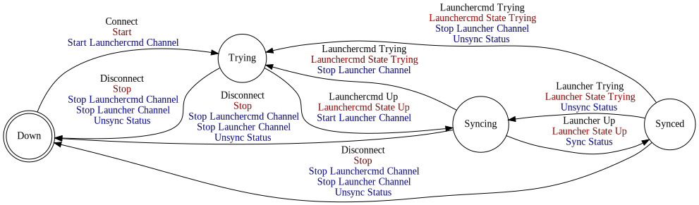

[//]: # (This file was autogenerated by docgen.gsl. Editing this file will result in loss of data.)
# Launcher Protocol

The Launcher protocol can be used to remotely start, stop and
monitor machinekit instances.

## Messages
<a name="msg_launcher_full_update" />
### LAUNCHER FULL UPDATE

Full update of the current launcher status.

#### Data Fields
* Each [Container](../machinetalk-protobuf.md#pb.Container) message MAY carry one [Launcher](../machinetalk-protobuf.md#pb.Launcher) message.                     
  * Each [Launcher](../machinetalk-protobuf.md#pb.Launcher) message MUST carry one [index](../machinetalk-protobuf.md#pb.Launcher.index) field.
  * Each [Launcher](../machinetalk-protobuf.md#pb.Launcher) message MUST carry one [name](../machinetalk-protobuf.md#pb.Launcher.name) field.
  * Each [Launcher](../machinetalk-protobuf.md#pb.Launcher) message MUST carry one [description](../machinetalk-protobuf.md#pb.Launcher.description) field.
  * Each [Launcher](../machinetalk-protobuf.md#pb.Launcher) message MAY carry one [File](../machinetalk-protobuf.md#pb.File) message.                             
    * Each [File](../machinetalk-protobuf.md#pb.File) message MUST carry one [name](../machinetalk-protobuf.md#pb.File.name) field.
    * Each [File](../machinetalk-protobuf.md#pb.File) message MUST carry one [encoding](../machinetalk-protobuf.md#pb.File.encoding) field.
    * Each [File](../machinetalk-protobuf.md#pb.File) message MUST carry one [bytes](../machinetalk-protobuf.md#pb.File.bytes) field.
  * Each [Launcher](../machinetalk-protobuf.md#pb.Launcher) message MUST carry one [MachineInfo](../machinetalk-protobuf.md#pb.MachineInfo) message.              
    * Each [MachineInfo](../machinetalk-protobuf.md#pb.MachineInfo) message MUST carry one [type](../machinetalk-protobuf.md#pb.MachineInfo.type) field.
    * Each [MachineInfo](../machinetalk-protobuf.md#pb.MachineInfo) message MUST carry one [manufacturer](../machinetalk-protobuf.md#pb.MachineInfo.manufacturer) field.
    * Each [MachineInfo](../machinetalk-protobuf.md#pb.MachineInfo) message MUST carry one [model](../machinetalk-protobuf.md#pb.MachineInfo.model) field.
    * Each [MachineInfo](../machinetalk-protobuf.md#pb.MachineInfo) message MUST carry one [variant](../machinetalk-protobuf.md#pb.MachineInfo.variant) field.
  * Each [Launcher](../machinetalk-protobuf.md#pb.Launcher) message MUST carry one [running](../machinetalk-protobuf.md#pb.Launcher.running) field.
  * Each [Launcher](../machinetalk-protobuf.md#pb.Launcher) message MUST carry one [terminating](../machinetalk-protobuf.md#pb.Launcher.terminating) field.
  * Each [Launcher](../machinetalk-protobuf.md#pb.Launcher) message MUST carry one [command](../machinetalk-protobuf.md#pb.Launcher.command) field.
  * Each [Launcher](../machinetalk-protobuf.md#pb.Launcher) message MUST carry one [shell](../machinetalk-protobuf.md#pb.Launcher.shell) field.
  * Each [Launcher](../machinetalk-protobuf.md#pb.Launcher) message MAY carry one [StdoutLine](../machinetalk-protobuf.md#pb.StdoutLine) message.                 
    * Each [StdoutLine](../machinetalk-protobuf.md#pb.StdoutLine) message MUST carry one [index](../machinetalk-protobuf.md#pb.StdoutLine.index) field.
    * Each [StdoutLine](../machinetalk-protobuf.md#pb.StdoutLine) message MUST carry one [line](../machinetalk-protobuf.md#pb.StdoutLine.line) field.
  * Each [Launcher](../machinetalk-protobuf.md#pb.Launcher) message MUST carry one [returncode](../machinetalk-protobuf.md#pb.Launcher.returncode) field.
  * Each [Launcher](../machinetalk-protobuf.md#pb.Launcher) message MUST carry one [workdir](../machinetalk-protobuf.md#pb.Launcher.workdir) field.
* Each [Container](../machinetalk-protobuf.md#pb.Container) message MAY carry one [ProtcolParameters](../machinetalk-protobuf.md#pb.ProtcolParameters) message.   
  * Each [ProtcolParameters](../machinetalk-protobuf.md#pb.ProtcolParameters) message MUST carry one [keepalive_timer](../machinetalk-protobuf.md#pb.ProtcolParameters.keepalive_timer) field.
* Each [Container](../machinetalk-protobuf.md#pb.Container) message MAY carry one [serial](../machinetalk-protobuf.md#pb.Container.serial) field.

<a name="msg_launcher_incremental_update" />
### LAUNCHER INCREMENTAL UPDATE

Incremental update of the current launcher status.

#### Data Fields
* Each [Container](../machinetalk-protobuf.md#pb.Container) message MAY carry one [Launcher](../machinetalk-protobuf.md#pb.Launcher) message.                     
  * Each [Launcher](../machinetalk-protobuf.md#pb.Launcher) message MUST carry one [index](../machinetalk-protobuf.md#pb.Launcher.index) field.
  * Each [Launcher](../machinetalk-protobuf.md#pb.Launcher) message MAY carry one [name](../machinetalk-protobuf.md#pb.Launcher.name) field.
  * Each [Launcher](../machinetalk-protobuf.md#pb.Launcher) message MAY carry one [description](../machinetalk-protobuf.md#pb.Launcher.description) field.
  * Each [Launcher](../machinetalk-protobuf.md#pb.Launcher) message MAY carry one [File](../machinetalk-protobuf.md#pb.File) message.                             
    * Each [File](../machinetalk-protobuf.md#pb.File) message MUST carry one [name](../machinetalk-protobuf.md#pb.File.name) field.
    * Each [File](../machinetalk-protobuf.md#pb.File) message MUST carry one [encoding](../machinetalk-protobuf.md#pb.File.encoding) field.
    * Each [File](../machinetalk-protobuf.md#pb.File) message MUST carry one [bytes](../machinetalk-protobuf.md#pb.File.bytes) field.
  * Each [Launcher](../machinetalk-protobuf.md#pb.Launcher) message MAY carry one [MachineInfo](../machinetalk-protobuf.md#pb.MachineInfo) message.               
    * Each [MachineInfo](../machinetalk-protobuf.md#pb.MachineInfo) message MAY carry one [type](../machinetalk-protobuf.md#pb.MachineInfo.type) field.
    * Each [MachineInfo](../machinetalk-protobuf.md#pb.MachineInfo) message MAY carry one [manufacturer](../machinetalk-protobuf.md#pb.MachineInfo.manufacturer) field.
    * Each [MachineInfo](../machinetalk-protobuf.md#pb.MachineInfo) message MAY carry one [model](../machinetalk-protobuf.md#pb.MachineInfo.model) field.
    * Each [MachineInfo](../machinetalk-protobuf.md#pb.MachineInfo) message MAY carry one [variant](../machinetalk-protobuf.md#pb.MachineInfo.variant) field.
  * Each [Launcher](../machinetalk-protobuf.md#pb.Launcher) message MAY carry one [running](../machinetalk-protobuf.md#pb.Launcher.running) field.
  * Each [Launcher](../machinetalk-protobuf.md#pb.Launcher) message MAY carry one [terminating](../machinetalk-protobuf.md#pb.Launcher.terminating) field.
  * Each [Launcher](../machinetalk-protobuf.md#pb.Launcher) message MAY carry one [command](../machinetalk-protobuf.md#pb.Launcher.command) field.
  * Each [Launcher](../machinetalk-protobuf.md#pb.Launcher) message MAY carry one [shell](../machinetalk-protobuf.md#pb.Launcher.shell) field.
  * Each [Launcher](../machinetalk-protobuf.md#pb.Launcher) message MAY carry one [StdoutLine](../machinetalk-protobuf.md#pb.StdoutLine) message.                 
    * Each [StdoutLine](../machinetalk-protobuf.md#pb.StdoutLine) message MUST carry one [index](../machinetalk-protobuf.md#pb.StdoutLine.index) field.
    * Each [StdoutLine](../machinetalk-protobuf.md#pb.StdoutLine) message MUST carry one [line](../machinetalk-protobuf.md#pb.StdoutLine.line) field.
  * Each [Launcher](../machinetalk-protobuf.md#pb.Launcher) message MAY carry one [returncode](../machinetalk-protobuf.md#pb.Launcher.returncode) field.
  * Each [Launcher](../machinetalk-protobuf.md#pb.Launcher) message MAY carry one [workdir](../machinetalk-protobuf.md#pb.Launcher.workdir) field.
* Each [Container](../machinetalk-protobuf.md#pb.Container) message MAY carry one [serial](../machinetalk-protobuf.md#pb.Container.serial) field.

<a name="msg_launcher_error" />
### LAUNCHER ERROR

NOT IMPLEMENTED.

#### Data Fields
* Each [Container](../machinetalk-protobuf.md#pb.Container) message MUST carry one or more [note](../machinetalk-protobuf.md#pb.Container.note) fields.

<a name="msg_error" />
### ERROR

Error on the launchercmd channel.

#### Data Fields
* Each [Container](../machinetalk-protobuf.md#pb.Container) message MUST carry one or more [note](../machinetalk-protobuf.md#pb.Container.note) fields.

<a name="msg_launcher_start" />
### LAUNCHER START

Starts a Machinekit instance.

#### Data Fields
* Each [Container](../machinetalk-protobuf.md#pb.Container) message MUST carry one [index](../machinetalk-protobuf.md#pb.Container.index) field.

<a name="msg_launcher_kill" />
### LAUNCHER KILL

Kills a Machinekit instance.

#### Data Fields
* Each [Container](../machinetalk-protobuf.md#pb.Container) message MUST carry one [index](../machinetalk-protobuf.md#pb.Container.index) field.

<a name="msg_launcher_terminate" />
### LAUNCHER TERMINATE

Terminates a Machinekit instance.

#### Data Fields
* Each [Container](../machinetalk-protobuf.md#pb.Container) message MUST carry one [index](../machinetalk-protobuf.md#pb.Container.index) field.

<a name="msg_launcher_write_stdin" />
### LAUNCHER WRITE STDIN

Writes to the standard input of a Machinekit instance.

#### Data Fields
* Each [Container](../machinetalk-protobuf.md#pb.Container) message MUST carry one [index](../machinetalk-protobuf.md#pb.Container.index) field.
* Each [Container](../machinetalk-protobuf.md#pb.Container) message MUST carry one [name](../machinetalk-protobuf.md#pb.Container.name) field.

<a name="msg_launcher_call" />
### LAUNCHER CALL

Runs a call on the Launcher Service.

#### Data Fields
* Each [Container](../machinetalk-protobuf.md#pb.Container) message MUST carry one [name](../machinetalk-protobuf.md#pb.Container.name) field.

<a name="msg_launcher_shutdown" />
### LAUNCHER SHUTDOWN

Issues a shutdown request to the Launcher Service.

## Launcher Base

Application Launcher Client

## State Machine

