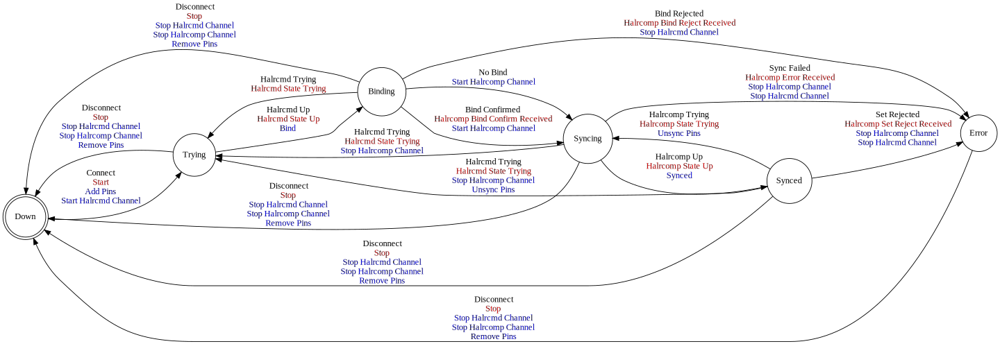

[//]: # (This file was autogenerated by docgen.gsl. Editing this file will result in loss of data.)
# HAL Remote Protocol

The HAL Remote protocol can be used to remotely interact with a HAL
instance.

## Messages
<a name="msg_halrcomp_bind" />
### HALRCOMP BIND

This message binds a HAL remote component to a HAL instance. If
the local description of the HAL component matches the remote
description the bind will be confirmend. In case the remote
instance does not exist prior to the bind request it will be
automatically created.

In case the remote instance of the component does not match the
description sent with the bind message, the bind request will be
rejected.

The *no_create* flag can be used to prevent the Haltalk server
from creating a new remote component instance in case none exists.

#### Data Fields
* Each [Container](../machinetalk-protobuf.md#pb.Container) message MUST carry one [Component](../machinetalk-protobuf.md#pb.Component) message.                  
  * Each [Component](../machinetalk-protobuf.md#pb.Component) message MUST carry one [name](../machinetalk-protobuf.md#pb.Component.name) field.
  * Each [Component](../machinetalk-protobuf.md#pb.Component) message MAY carry one [no_create](../machinetalk-protobuf.md#pb.Component.no_create) field.
  * Each [Component](../machinetalk-protobuf.md#pb.Component) message MUST carry one or more [Pin](../machinetalk-protobuf.md#pb.Pin) messages.                   
    * Each [Pin](../machinetalk-protobuf.md#pb.Pin) message MUST carry one [name](../machinetalk-protobuf.md#pb.Pin.name) field.
    * Each [Pin](../machinetalk-protobuf.md#pb.Pin) message MUST carry one [type](../machinetalk-protobuf.md#pb.Pin.type) field.
    * Each [Pin](../machinetalk-protobuf.md#pb.Pin) message MUST carry one [dir](../machinetalk-protobuf.md#pb.Pin.dir) field.
    * Each [Pin](../machinetalk-protobuf.md#pb.Pin) message MUST carry one of the following fields
      * [halfloat](../machinetalk-protobuf.md#pb.Pin.halfloat)
      * [halbit](../machinetalk-protobuf.md#pb.Pin.halbit)
      * [hals32](../machinetalk-protobuf.md#pb.Pin.hals32)
      * [halu32](../machinetalk-protobuf.md#pb.Pin.halu32)

#### Possible Responses
* [HALRCOMP BIND CONFIRM](#msg_halrcomp_bind_confirm)
* [HALRCOMP BIND REJECT](#msg_halrcomp_bind_reject)

<a name="msg_halrcomp_bind_confirm" />
### HALRCOMP BIND CONFIRM

This message confirms that the bind request was successful. The
client can now subscribe to status updates about the remote
component from Haltalk.

#### Response to
* [HALRCOMP BIND](#msg_halrcomp_bind)

<a name="msg_halrcomp_bind_reject" />
### HALRCOMP BIND REJECT

A bind request has been rejected by Haltalk. The *note* field
contains information about the error message.

#### Data Fields
* Each [Container](../machinetalk-protobuf.md#pb.Container) message MUST carry one or more [Note](../machinetalk-protobuf.md#pb.Note) messages.                   

#### Response to
* [HALRCOMP BIND](#msg_halrcomp_bind)

<a name="msg_halrcomp_set" />
### HALRCOMP SET

The *halrcomp set* message is used to update pin values of remote
component instances. Either the *name* or the *handle* field can
be used to address individual pins. Using the *handle* field
allows faster addressing inside Hatalk and is therefore the
recommended way when a local description of the remote component
exists.

In case the *set* request cannot be issued by the Haltalk instance a
*set reject* message will be returned.

If the optional *reply_required* field is set to true a
acknowledgement message will be returned in case the request is
successful.

#### Data Fields
* Each [Container](../machinetalk-protobuf.md#pb.Container) message MUST carry one or more [Pin](../machinetalk-protobuf.md#pb.Pin) messages.                     
  * Each [Pin](../machinetalk-protobuf.md#pb.Pin) message MUST carry one [type](../machinetalk-protobuf.md#pb.Pin.type) field.
  * Each [Pin](../machinetalk-protobuf.md#pb.Pin) message MUST carry one of the following fields
    * [handle](../machinetalk-protobuf.md#pb.Pin.handle)
    * [name](../machinetalk-protobuf.md#pb.Pin.name)
  * Each [Pin](../machinetalk-protobuf.md#pb.Pin) message MUST carry one of the following fields
    * [halfloat](../machinetalk-protobuf.md#pb.Pin.halfloat)
    * [halbit](../machinetalk-protobuf.md#pb.Pin.halbit)
    * [hals32](../machinetalk-protobuf.md#pb.Pin.hals32)
    * [halu32](../machinetalk-protobuf.md#pb.Pin.halu32)
* Each [Container](../machinetalk-protobuf.md#pb.Container) message MAY carry one [reply_required](../machinetalk-protobuf.md#pb.Container.reply_required) field.

#### Possible Responses
* [HALRCOMP SET REJECT](#msg_halrcomp_set_reject)
* [HALRCOMP ACK](#msg_halrcomp_ack)

<a name="msg_halrcomp_set_reject" />
### HALRCOMP SET REJECT

A pin set request has been rejected by Haltalk. The *note* field
contains information about the error message.

#### Data Fields
* Each [Container](../machinetalk-protobuf.md#pb.Container) message MUST carry one or more [Note](../machinetalk-protobuf.md#pb.Note) messages.                   

#### Response to
* [HALRCOMP SET](#msg_halrcomp_set)

<a name="msg_halrcomp_ack" />
### HALRCOMP ACK

Acknowledgement for pin set request from Haltalk.

#### Response to
* [HALRCOMP SET](#msg_halrcomp_set)

<a name="msg_halrcomp_full_update" />
### HALRCOMP FULL UPDATE

Full status update from Haltalk. This message is sent when a
client requests a full state synchronization. It contains the most
recent state of the remote component and the pin *handles*
required to update remote pins.

#### Data Fields
* Each [Container](../machinetalk-protobuf.md#pb.Container) message MUST carry one [Component](../machinetalk-protobuf.md#pb.Component) message.                  
  * Each [Component](../machinetalk-protobuf.md#pb.Component) message MUST carry one [name](../machinetalk-protobuf.md#pb.Component.name) field.
  * Each [Component](../machinetalk-protobuf.md#pb.Component) message MUST carry one or more [Pin](../machinetalk-protobuf.md#pb.Pin) messages.                   
    * Each [Pin](../machinetalk-protobuf.md#pb.Pin) message MUST carry one [name](../machinetalk-protobuf.md#pb.Pin.name) field.
    * Each [Pin](../machinetalk-protobuf.md#pb.Pin) message MUST carry one [handle](../machinetalk-protobuf.md#pb.Pin.handle) field.
    * Each [Pin](../machinetalk-protobuf.md#pb.Pin) message MUST carry one [type](../machinetalk-protobuf.md#pb.Pin.type) field.
    * Each [Pin](../machinetalk-protobuf.md#pb.Pin) message MUST carry one [dir](../machinetalk-protobuf.md#pb.Pin.dir) field.
    * Each [Pin](../machinetalk-protobuf.md#pb.Pin) message MUST carry one of the following fields
      * [halfloat](../machinetalk-protobuf.md#pb.Pin.halfloat)
      * [halbit](../machinetalk-protobuf.md#pb.Pin.halbit)
      * [hals32](../machinetalk-protobuf.md#pb.Pin.hals32)
      * [halu32](../machinetalk-protobuf.md#pb.Pin.halu32)
* Each [Container](../machinetalk-protobuf.md#pb.Container) message MAY carry one [ProtcolParameters](../machinetalk-protobuf.md#pb.ProtcolParameters) message.   
  * Each [ProtcolParameters](../machinetalk-protobuf.md#pb.ProtcolParameters) message MUST carry one [keepalive_timer](../machinetalk-protobuf.md#pb.ProtcolParameters.keepalive_timer) field.
* Each [Container](../machinetalk-protobuf.md#pb.Container) message MAY carry one [serial](../machinetalk-protobuf.md#pb.Container.serial) field.
* Each [Container](../machinetalk-protobuf.md#pb.Container) message MAY carry one [uuid](../machinetalk-protobuf.md#pb.Container.uuid) field.

<a name="msg_halrcomp_incremental_update" />
### HALRCOMP INCREMENTAL UPDATE

Incremental status update from Haltalk. This message is sent every
time a pin change has been detected in the remote instance of the
remote component. Pin *handles* are used to address individual pins.

#### Data Fields
* Each [Container](../machinetalk-protobuf.md#pb.Container) message MUST carry one or more [Pin](../machinetalk-protobuf.md#pb.Pin) messages.                     
  * Each [Pin](../machinetalk-protobuf.md#pb.Pin) message MUST carry one [handle](../machinetalk-protobuf.md#pb.Pin.handle) field.
  * Each [Pin](../machinetalk-protobuf.md#pb.Pin) message MAY carry one [name](../machinetalk-protobuf.md#pb.Pin.name) field.
  * Each [Pin](../machinetalk-protobuf.md#pb.Pin) message MAY carry one [type](../machinetalk-protobuf.md#pb.Pin.type) field.
  * Each [Pin](../machinetalk-protobuf.md#pb.Pin) message MUST carry one of the following fields
    * [halfloat](../machinetalk-protobuf.md#pb.Pin.halfloat)
    * [halbit](../machinetalk-protobuf.md#pb.Pin.halbit)
    * [hals32](../machinetalk-protobuf.md#pb.Pin.hals32)
    * [halu32](../machinetalk-protobuf.md#pb.Pin.halu32)
* Each [Container](../machinetalk-protobuf.md#pb.Container) message MAY carry one [serial](../machinetalk-protobuf.md#pb.Container.serial) field.
* Each [Container](../machinetalk-protobuf.md#pb.Container) message MAY carry one [uuid](../machinetalk-protobuf.md#pb.Container.uuid) field.

<a name="msg_halrcomp_error" />
### HALRCOMP ERROR

A error occured on the halrcomp channel. The *note* field contains
information about the error message.

#### Data Fields
* Each [Container](../machinetalk-protobuf.md#pb.Container) message MUST carry one or more [Note](../machinetalk-protobuf.md#pb.Note) messages.                   

<a name="msg_halrcommand_error" />
### HALRCOMMAND ERROR

A error occured on the halrcmd channel. The *note* field contains
information about the error message.

#### Data Fields
* Each [Container](../machinetalk-protobuf.md#pb.Container) message MUST carry one or more [Note](../machinetalk-protobuf.md#pb.Note) messages.                   

<a name="msg_halrcommand_set" />
### HALRCOMMAND SET

The *halrcommand set* message is used to update pin values of
unbound input pins and signals in a HAL configuration. Either the
*name* or the *handle* field can be used to address individual
pins and signals. Using the *handle* field allows faster
addressing inside Haltalk and is therefore the recommended way if
a local description of the HAL configuration exists.

The difference of this command to the *halrcomp set* command is,
that this command operates on input pins as if they would be
changed from outside whereas *halrcomp set* works on output pins
as if they would be changed from inside the remote component.

In case the *set* request cannot be issued by the Haltalk instance
a *set reject* message will be returned.

If the optional *reply_required* is set to true a acknowledgement
message will be returned in case the request is successful.

#### Data Fields
* Each [Container](../machinetalk-protobuf.md#pb.Container) message MAY carry one [Pin](../machinetalk-protobuf.md#pb.Pin) message.                               
  * Each [Pin](../machinetalk-protobuf.md#pb.Pin) message MUST carry one [type](../machinetalk-protobuf.md#pb.Pin.type) field.
  * Each [Pin](../machinetalk-protobuf.md#pb.Pin) message MUST carry one of the following fields
    * [handle](../machinetalk-protobuf.md#pb.Pin.handle)
    * [name](../machinetalk-protobuf.md#pb.Pin.name)
  * Each [Pin](../machinetalk-protobuf.md#pb.Pin) message MUST carry one of the following fields
    * [halfloat](../machinetalk-protobuf.md#pb.Pin.halfloat)
    * [halbit](../machinetalk-protobuf.md#pb.Pin.halbit)
    * [hals32](../machinetalk-protobuf.md#pb.Pin.hals32)
    * [halu32](../machinetalk-protobuf.md#pb.Pin.halu32)
* Each [Container](../machinetalk-protobuf.md#pb.Container) message MAY carry one [Signal](../machinetalk-protobuf.md#pb.Signal) message.                         
  * Each [Signal](../machinetalk-protobuf.md#pb.Signal) message MUST carry one [type](../machinetalk-protobuf.md#pb.Signal.type) field.
  * Each [Signal](../machinetalk-protobuf.md#pb.Signal) message MUST carry one of the following fields
    * [handle](../machinetalk-protobuf.md#pb.Signal.handle)
    * [name](../machinetalk-protobuf.md#pb.Signal.name)
  * Each [Signal](../machinetalk-protobuf.md#pb.Signal) message MUST carry one of the following fields
    * [halfloat](../machinetalk-protobuf.md#pb.Signal.halfloat)
    * [halbit](../machinetalk-protobuf.md#pb.Signal.halbit)
    * [hals32](../machinetalk-protobuf.md#pb.Signal.hals32)
    * [halu32](../machinetalk-protobuf.md#pb.Signal.halu32)
* Each [Container](../machinetalk-protobuf.md#pb.Container) message MAY carry one [reply_required](../machinetalk-protobuf.md#pb.Container.reply_required) field.

#### Possible Responses
* [HALRCOMMAND SET REJECT](#msg_halrcommand_set_reject)
* [HALRCOMMAND ACK](#msg_halrcommand_ack)

<a name="msg_halrcommand_set_reject" />
### HALRCOMMAND SET REJECT

A pin/signal set request has been rejected by Haltalk. The *note*
field contains information about the error message.

#### Data Fields
* Each [Container](../machinetalk-protobuf.md#pb.Container) message MUST carry one or more [Note](../machinetalk-protobuf.md#pb.Note) messages.                   

#### Response to
* [HALRCOMMAND SET](#msg_halrcommand_set)

<a name="msg_halrcommand_ack" />
### HALRCOMMAND ACK

Acknowledgement for pin/signal set request from Haltalk.

#### Data Fields
* Each [Container](../machinetalk-protobuf.md#pb.Container) message MAY carry one [Pin](../machinetalk-protobuf.md#pb.Pin) message.                               
  * Each [Pin](../machinetalk-protobuf.md#pb.Pin) message MUST carry one [handle](../machinetalk-protobuf.md#pb.Pin.handle) field.
  * Each [Pin](../machinetalk-protobuf.md#pb.Pin) message MAY carry one [name](../machinetalk-protobuf.md#pb.Pin.name) field.
  * Each [Pin](../machinetalk-protobuf.md#pb.Pin) message MAY carry one [type](../machinetalk-protobuf.md#pb.Pin.type) field.
  * Each [Pin](../machinetalk-protobuf.md#pb.Pin) message MAY carry one [dir](../machinetalk-protobuf.md#pb.Pin.dir) field.
  * Each [Pin](../machinetalk-protobuf.md#pb.Pin) message MUST carry one [linked](../machinetalk-protobuf.md#pb.Pin.linked) field.
  * Each [Pin](../machinetalk-protobuf.md#pb.Pin) message MUST carry one [flags](../machinetalk-protobuf.md#pb.Pin.flags) field.
  * Each [Pin](../machinetalk-protobuf.md#pb.Pin) message MAY carry one [epsilon](../machinetalk-protobuf.md#pb.Pin.epsilon) field.
  * Each [Pin](../machinetalk-protobuf.md#pb.Pin) message MUST carry one of the following fields
    * [halfloat](../machinetalk-protobuf.md#pb.Pin.halfloat)
    * [halbit](../machinetalk-protobuf.md#pb.Pin.halbit)
    * [hals32](../machinetalk-protobuf.md#pb.Pin.hals32)
    * [halu32](../machinetalk-protobuf.md#pb.Pin.halu32)
* Each [Container](../machinetalk-protobuf.md#pb.Container) message MAY carry one [Signal](../machinetalk-protobuf.md#pb.Signal) message.                         
  * Each [Signal](../machinetalk-protobuf.md#pb.Signal) message MUST carry one [handle](../machinetalk-protobuf.md#pb.Signal.handle) field.
  * Each [Signal](../machinetalk-protobuf.md#pb.Signal) message MAY carry one [name](../machinetalk-protobuf.md#pb.Signal.name) field.
  * Each [Signal](../machinetalk-protobuf.md#pb.Signal) message MAY carry one [type](../machinetalk-protobuf.md#pb.Signal.type) field.
  * Each [Signal](../machinetalk-protobuf.md#pb.Signal) message MAY carry one [readers](../machinetalk-protobuf.md#pb.Signal.readers) field.
  * Each [Signal](../machinetalk-protobuf.md#pb.Signal) message MAY carry one [writers](../machinetalk-protobuf.md#pb.Signal.writers) field.
  * Each [Signal](../machinetalk-protobuf.md#pb.Signal) message MAY carry one [bidirs](../machinetalk-protobuf.md#pb.Signal.bidirs) field.
  * Each [Signal](../machinetalk-protobuf.md#pb.Signal) message MUST carry one of the following fields
    * [halfloat](../machinetalk-protobuf.md#pb.Signal.halfloat)
    * [halbit](../machinetalk-protobuf.md#pb.Signal.halbit)
    * [hals32](../machinetalk-protobuf.md#pb.Signal.hals32)
    * [halu32](../machinetalk-protobuf.md#pb.Signal.halu32)

#### Response to
* [HALRCOMMAND SET](#msg_halrcommand_set)
* [HALRCOMMAND GET](#msg_halrcommand_get)

<a name="msg_halrcommand_get" />
### HALRCOMMAND GET

This message queries the value of a pin or signal of the HAL
configuration.

If the request was successful a acknowledgement message will be
returned.

If an error occured when processing the request in Haltalk a *get
reject* message will be returned.

#### Data Fields
* Each [Container](../machinetalk-protobuf.md#pb.Container) message MAY carry one [Pin](../machinetalk-protobuf.md#pb.Pin) message.                               
  * Each [Pin](../machinetalk-protobuf.md#pb.Pin) message MUST carry one of the following fields
    * [handle](../machinetalk-protobuf.md#pb.Pin.handle)
    * [name](../machinetalk-protobuf.md#pb.Pin.name)
* Each [Container](../machinetalk-protobuf.md#pb.Container) message MAY carry one [Signal](../machinetalk-protobuf.md#pb.Signal) message.                         
  * Each [Signal](../machinetalk-protobuf.md#pb.Signal) message MUST carry one of the following fields
    * [handle](../machinetalk-protobuf.md#pb.Signal.handle)
    * [name](../machinetalk-protobuf.md#pb.Signal.name)

#### Possible Responses
* [HALRCOMMAND GET REJECT](#msg_halrcommand_get_reject)
* [HALRCOMMAND ACK](#msg_halrcommand_ack)

<a name="msg_halrcommand_get_reject" />
### HALRCOMMAND GET REJECT

A pin/signal get request has been rejected by Haltalk. The *note*
field contains information about the error message.

#### Data Fields
* Each [Container](../machinetalk-protobuf.md#pb.Container) message MUST carry one or more [Note](../machinetalk-protobuf.md#pb.Note) messages.                   

#### Response to
* [HALRCOMMAND GET](#msg_halrcommand_get)

<a name="msg_halrcommand_describe" />
### HALRCOMMAND DESCRIBE

This command requests a complete description of the HAL
configuration.

#### Possible Responses
* [HALRCOMMAND DESCRIPTION](#msg_halrcommand_description)

<a name="msg_halrcommand_description" />
### HALRCOMMAND DESCRIPTION

Complete description of the HAL configuration.

#### Data Fields
* Each [Container](../machinetalk-protobuf.md#pb.Container) message MAY carry one [Component](../machinetalk-protobuf.md#pb.Component) message.                   
  * Each [Component](../machinetalk-protobuf.md#pb.Component) message MUST carry one [name](../machinetalk-protobuf.md#pb.Component.name) field.
  * Each [Component](../machinetalk-protobuf.md#pb.Component) message MUST carry one [comp_id](../machinetalk-protobuf.md#pb.Component.comp_id) field.
  * Each [Component](../machinetalk-protobuf.md#pb.Component) message MUST carry one [type](../machinetalk-protobuf.md#pb.Component.type) field.
  * Each [Component](../machinetalk-protobuf.md#pb.Component) message MUST carry one [state](../machinetalk-protobuf.md#pb.Component.state) field.
  * Each [Component](../machinetalk-protobuf.md#pb.Component) message MUST carry one [last_update](../machinetalk-protobuf.md#pb.Component.last_update) field.
  * Each [Component](../machinetalk-protobuf.md#pb.Component) message MUST carry one [last_bound](../machinetalk-protobuf.md#pb.Component.last_bound) field.
  * Each [Component](../machinetalk-protobuf.md#pb.Component) message MUST carry one [last_unbound](../machinetalk-protobuf.md#pb.Component.last_unbound) field.
  * Each [Component](../machinetalk-protobuf.md#pb.Component) message MUST carry one [pid](../machinetalk-protobuf.md#pb.Component.pid) field.
  * Each [Component](../machinetalk-protobuf.md#pb.Component) message MAY carry one [args](../machinetalk-protobuf.md#pb.Component.args) field.
  * Each [Component](../machinetalk-protobuf.md#pb.Component) message MUST carry one [userarg1](../machinetalk-protobuf.md#pb.Component.userarg1) field.
  * Each [Component](../machinetalk-protobuf.md#pb.Component) message MUST carry one [userarg2](../machinetalk-protobuf.md#pb.Component.userarg2) field.
  * Each [Component](../machinetalk-protobuf.md#pb.Component) message MAY carry one [Pin](../machinetalk-protobuf.md#pb.Pin) message.                             
    * Each [Pin](../machinetalk-protobuf.md#pb.Pin) message MUST carry one [type](../machinetalk-protobuf.md#pb.Pin.type) field.
    * Each [Pin](../machinetalk-protobuf.md#pb.Pin) message MUST carry one [dir](../machinetalk-protobuf.md#pb.Pin.dir) field.
    * Each [Pin](../machinetalk-protobuf.md#pb.Pin) message MUST carry one [handle](../machinetalk-protobuf.md#pb.Pin.handle) field.
    * Each [Pin](../machinetalk-protobuf.md#pb.Pin) message MUST carry one [name](../machinetalk-protobuf.md#pb.Pin.name) field.
    * Each [Pin](../machinetalk-protobuf.md#pb.Pin) message MUST carry one [linked](../machinetalk-protobuf.md#pb.Pin.linked) field.
    * Each [Pin](../machinetalk-protobuf.md#pb.Pin) message MUST carry one [flags](../machinetalk-protobuf.md#pb.Pin.flags) field.
    * Each [Pin](../machinetalk-protobuf.md#pb.Pin) message MAY carry one [epsilon](../machinetalk-protobuf.md#pb.Pin.epsilon) field.
    * Each [Pin](../machinetalk-protobuf.md#pb.Pin) message MUST carry one of the following fields
      * [halfloat](../machinetalk-protobuf.md#pb.Pin.halfloat)
      * [halbit](../machinetalk-protobuf.md#pb.Pin.halbit)
      * [hals32](../machinetalk-protobuf.md#pb.Pin.hals32)
      * [halu32](../machinetalk-protobuf.md#pb.Pin.halu32)
  * Each [Component](../machinetalk-protobuf.md#pb.Component) message MAY carry one [Param](../machinetalk-protobuf.md#pb.Param) message.                         
    * Each [Param](../machinetalk-protobuf.md#pb.Param) message MUST carry one [type](../machinetalk-protobuf.md#pb.Param.type) field.
    * Each [Param](../machinetalk-protobuf.md#pb.Param) message MUST carry one [dir](../machinetalk-protobuf.md#pb.Param.dir) field.
    * Each [Param](../machinetalk-protobuf.md#pb.Param) message MUST carry one [handle](../machinetalk-protobuf.md#pb.Param.handle) field.
    * Each [Param](../machinetalk-protobuf.md#pb.Param) message MUST carry one [name](../machinetalk-protobuf.md#pb.Param.name) field.
    * Each [Param](../machinetalk-protobuf.md#pb.Param) message MUST carry one of the following fields
      * [halfloat](../machinetalk-protobuf.md#pb.Param.halfloat)
      * [halbit](../machinetalk-protobuf.md#pb.Param.halbit)
      * [hals32](../machinetalk-protobuf.md#pb.Param.hals32)
      * [halu32](../machinetalk-protobuf.md#pb.Param.halu32)
* Each [Container](../machinetalk-protobuf.md#pb.Container) message MAY carry one [Signal](../machinetalk-protobuf.md#pb.Signal) message.                         
  * Each [Signal](../machinetalk-protobuf.md#pb.Signal) message MUST carry one [name](../machinetalk-protobuf.md#pb.Signal.name) field.
  * Each [Signal](../machinetalk-protobuf.md#pb.Signal) message MUST carry one [type](../machinetalk-protobuf.md#pb.Signal.type) field.
  * Each [Signal](../machinetalk-protobuf.md#pb.Signal) message MUST carry one [readers](../machinetalk-protobuf.md#pb.Signal.readers) field.
  * Each [Signal](../machinetalk-protobuf.md#pb.Signal) message MUST carry one [writers](../machinetalk-protobuf.md#pb.Signal.writers) field.
  * Each [Signal](../machinetalk-protobuf.md#pb.Signal) message MUST carry one [bidirs](../machinetalk-protobuf.md#pb.Signal.bidirs) field.
  * Each [Signal](../machinetalk-protobuf.md#pb.Signal) message MUST carry one [handle](../machinetalk-protobuf.md#pb.Signal.handle) field.
  * Each [Signal](../machinetalk-protobuf.md#pb.Signal) message MUST carry one of the following fields
    * [halfloat](../machinetalk-protobuf.md#pb.Signal.halfloat)
    * [halbit](../machinetalk-protobuf.md#pb.Signal.halbit)
    * [hals32](../machinetalk-protobuf.md#pb.Signal.hals32)
    * [halu32](../machinetalk-protobuf.md#pb.Signal.halu32)
* Each [Container](../machinetalk-protobuf.md#pb.Container) message MAY carry one [Group](../machinetalk-protobuf.md#pb.Group) message.                           
  * Each [Group](../machinetalk-protobuf.md#pb.Group) message MUST carry one [name](../machinetalk-protobuf.md#pb.Group.name) field.
  * Each [Group](../machinetalk-protobuf.md#pb.Group) message MUST carry one [handle](../machinetalk-protobuf.md#pb.Group.handle) field.
  * Each [Group](../machinetalk-protobuf.md#pb.Group) message MUST carry one [refcount](../machinetalk-protobuf.md#pb.Group.refcount) field.
  * Each [Group](../machinetalk-protobuf.md#pb.Group) message MUST carry one [userarg1](../machinetalk-protobuf.md#pb.Group.userarg1) field.
  * Each [Group](../machinetalk-protobuf.md#pb.Group) message MUST carry one [userarg2](../machinetalk-protobuf.md#pb.Group.userarg2) field.
  * Each [Group](../machinetalk-protobuf.md#pb.Group) message MAY carry one [Member](../machinetalk-protobuf.md#pb.Member) message.                               
    * Each [Member](../machinetalk-protobuf.md#pb.Member) message MUST carry one [mtype](../machinetalk-protobuf.md#pb.Member.mtype) field.
    * Each [Member](../machinetalk-protobuf.md#pb.Member) message MAY carry one [userarg1](../machinetalk-protobuf.md#pb.Member.userarg1) field.
    * Each [Member](../machinetalk-protobuf.md#pb.Member) message MAY carry one [epsilon](../machinetalk-protobuf.md#pb.Member.epsilon) field.
    * Each [Member](../machinetalk-protobuf.md#pb.Member) message MAY carry one [groupname](../machinetalk-protobuf.md#pb.Member.groupname) field.
    * Each [Member](../machinetalk-protobuf.md#pb.Member) message MAY carry one [handle](../machinetalk-protobuf.md#pb.Member.handle) field.
    * Each [Member](../machinetalk-protobuf.md#pb.Member) message MAY carry one [Signal](../machinetalk-protobuf.md#pb.Signal) message.                           
      * Each [Signal](../machinetalk-protobuf.md#pb.Signal) message MUST carry one [name](../machinetalk-protobuf.md#pb.Signal.name) field.
      * Each [Signal](../machinetalk-protobuf.md#pb.Signal) message MUST carry one [type](../machinetalk-protobuf.md#pb.Signal.type) field.
      * Each [Signal](../machinetalk-protobuf.md#pb.Signal) message MUST carry one [readers](../machinetalk-protobuf.md#pb.Signal.readers) field.
      * Each [Signal](../machinetalk-protobuf.md#pb.Signal) message MUST carry one [writers](../machinetalk-protobuf.md#pb.Signal.writers) field.
      * Each [Signal](../machinetalk-protobuf.md#pb.Signal) message MUST carry one [bidirs](../machinetalk-protobuf.md#pb.Signal.bidirs) field.
      * Each [Signal](../machinetalk-protobuf.md#pb.Signal) message MUST carry one [handle](../machinetalk-protobuf.md#pb.Signal.handle) field.
      * Each [Signal](../machinetalk-protobuf.md#pb.Signal) message MUST carry one of the following fields
        * [halfloat](../machinetalk-protobuf.md#pb.Signal.halfloat)
        * [halbit](../machinetalk-protobuf.md#pb.Signal.halbit)
        * [hals32](../machinetalk-protobuf.md#pb.Signal.hals32)
        * [halu32](../machinetalk-protobuf.md#pb.Signal.halu32)
* Each [Container](../machinetalk-protobuf.md#pb.Container) message MAY carry one [Function](../machinetalk-protobuf.md#pb.Function) message.                     
  * Each [Function](../machinetalk-protobuf.md#pb.Function) message MUST carry one [ower_id](../machinetalk-protobuf.md#pb.Function.ower_id) field.
  * Each [Function](../machinetalk-protobuf.md#pb.Function) message MUST carry one [name](../machinetalk-protobuf.md#pb.Function.name) field.
  * Each [Function](../machinetalk-protobuf.md#pb.Function) message MUST carry one [handle](../machinetalk-protobuf.md#pb.Function.handle) field.
  * Each [Function](../machinetalk-protobuf.md#pb.Function) message MUST carry one [users](../machinetalk-protobuf.md#pb.Function.users) field.
  * Each [Function](../machinetalk-protobuf.md#pb.Function) message MUST carry one [runtime](../machinetalk-protobuf.md#pb.Function.runtime) field.
  * Each [Function](../machinetalk-protobuf.md#pb.Function) message MUST carry one [maxtime](../machinetalk-protobuf.md#pb.Function.maxtime) field.
  * Each [Function](../machinetalk-protobuf.md#pb.Function) message MUST carry one [reentrant](../machinetalk-protobuf.md#pb.Function.reentrant) field.
* Each [Container](../machinetalk-protobuf.md#pb.Container) message MAY carry one [Ring](../machinetalk-protobuf.md#pb.Ring) message.                             
  * Each [Ring](../machinetalk-protobuf.md#pb.Ring) message MUST carry one [name](../machinetalk-protobuf.md#pb.Ring.name) field.
  * Each [Ring](../machinetalk-protobuf.md#pb.Ring) message MUST carry one [handle](../machinetalk-protobuf.md#pb.Ring.handle) field.
* Each [Container](../machinetalk-protobuf.md#pb.Container) message MAY carry one [Thread](../machinetalk-protobuf.md#pb.Thread) message.                         
  * Each [Thread](../machinetalk-protobuf.md#pb.Thread) message MUST carry one [name](../machinetalk-protobuf.md#pb.Thread.name) field.
  * Each [Thread](../machinetalk-protobuf.md#pb.Thread) message MUST carry one [handle](../machinetalk-protobuf.md#pb.Thread.handle) field.
  * Each [Thread](../machinetalk-protobuf.md#pb.Thread) message MUST carry one [uses_fp](../machinetalk-protobuf.md#pb.Thread.uses_fp) field.
  * Each [Thread](../machinetalk-protobuf.md#pb.Thread) message MUST carry one [period](../machinetalk-protobuf.md#pb.Thread.period) field.
  * Each [Thread](../machinetalk-protobuf.md#pb.Thread) message MUST carry one [priority](../machinetalk-protobuf.md#pb.Thread.priority) field.
  * Each [Thread](../machinetalk-protobuf.md#pb.Thread) message MUST carry one [task_id](../machinetalk-protobuf.md#pb.Thread.task_id) field.
  * Each [Thread](../machinetalk-protobuf.md#pb.Thread) message MUST carry one [cpu_id](../machinetalk-protobuf.md#pb.Thread.cpu_id) field.
  * Each [Thread](../machinetalk-protobuf.md#pb.Thread) message MUST carry one or more [function](../machinetalk-protobuf.md#pb.Thread.function) fields.

#### Response to
* [HALRCOMMAND DESCRIBE](#msg_halrcommand_describe)

<a name="msg_halrcommand_create" />
### HALRCOMMAND CREATE

NOT IMPLEMENTED

<a name="msg_halrcommand_delete" />
### HALRCOMMAND DELETE

NOT IMPLEMENTED

## Remote Component Base

HAL Remote Component Client

## State Machine

