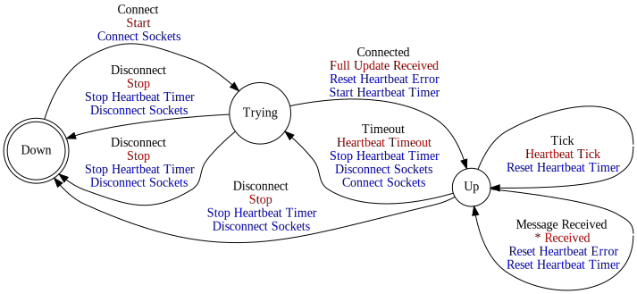
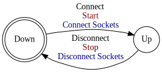

[//]: # (This file was autogenerated by docgen.gsl. Editing this file will result in loss of data.)
# Pub-Sub Protocol

The Machintalk Pub-Sub Protocol provides a realiable channel for
Publish-Subscribe based interfaces.

The Pub-Sub channel is unidirectional and therefore no realiable way
to send message from subscriber to publisher exists. However, some
transports provide notification about new subscribers starting to
listen. Depending on the implementation a second channel might be
necessary to request new full updates from the service.

## Messages
<a name="msg_full_update" />
### FULL UPDATE

A full value update from the service. The full update synchronizes
all values and therefore marks the values as synced. Any further
updates to values are pushed using the incremental update.

#### Data Fields
* Each [Container](../machinetalk-protobuf.md#pb.Container) message MAY carry one [ProtcolParameters](../machinetalk-protobuf.md#pb.ProtcolParameters) message.   
  * Each [ProtcolParameters](../machinetalk-protobuf.md#pb.ProtcolParameters) message MUST carry one [keepalive_timer](../machinetalk-protobuf.md#pb.ProtcolParameters.keepalive_timer) field.

<a name="msg_incremental_update" />
### INCREMENTAL UPDATE

The incremental update message contains incremental value
updates. If a incremental update is missed a new full update needs
to be requested in order to get a consistent state.

<a name="msg_ping" />
### PING

A ping is sent to keep a connection alive when no other messages
need to be sent on a channel. The frequency with whom  ping
messages are sent depends on the implementation.

## Subscribe

Subscribe

## State Machine

## Publish

Publish

## State Machine

