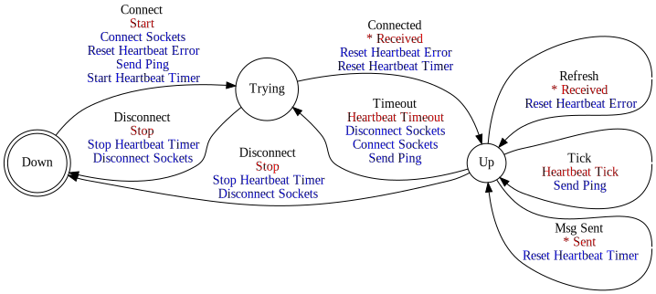

[//]: # (This file was autogenerated by docgen.gsl. Editing this file will result in loss of data.)
# RPC Protocol

The Machinetalk RPC Protocol provides a realiable RPC interface for Machinetalk.
It is designed with as RESTful interface.

## Messages
<a name="msg_ping" />
### PING

Ping from client to service. The PING message is used in the client
to check if a remote service is still present. Furthermore, some type
of connections require a transfer every once in while to be kept alive
by the operating system.

#### Possible Responses
* [PING ACKNOWLEDGE](#msg_ping_acknowledge)

<a name="msg_ping_acknowledge" />
### PING ACKNOWLEDGE

Service response to ping from client.

#### Response to
* [PING](#msg_ping)

## RPC Client

RPC/Client

## State Machine

## RPC Service

RPC/Service

## State Machine

