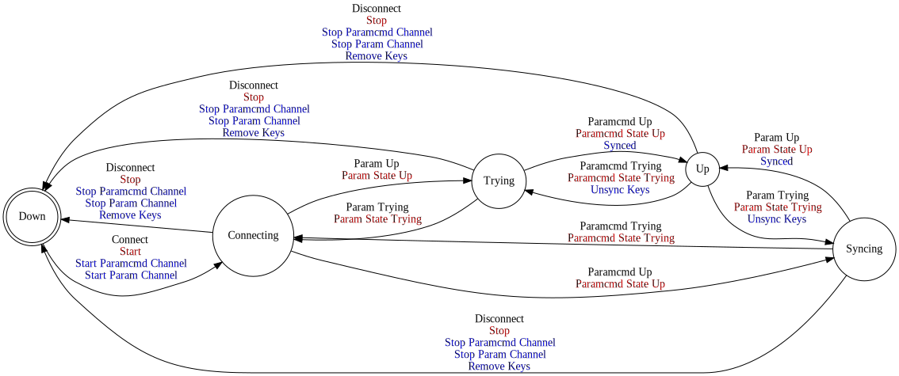
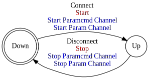

[//]: # (This file was autogenerated by docgen.gsl. Editing this file will result in loss of data.)
# Param Protocol

The Parameter Protocol can be used to synchronize two key value storage databases.

## Messages
<a name="msg_full_update" />
### FULL UPDATE

Full update from service provider to service consumer.

#### Data Fields
* Each [Container](../machinetalk-protobuf.md#pb.Container) message MUST carry one or more [Key](../machinetalk-protobuf.md#pb.Key) messages.                     
  * Each [Key](../machinetalk-protobuf.md#pb.Key) message MUST carry one [name](../machinetalk-protobuf.md#pb.Key.name) field.
  * Each [Key](../machinetalk-protobuf.md#pb.Key) message MUST carry one [type](../machinetalk-protobuf.md#pb.Key.type) field.
  * Each [Key](../machinetalk-protobuf.md#pb.Key) message MUST carry one of the following fields
    * [paramstring](../machinetalk-protobuf.md#pb.Key.paramstring)
    * [parambinary](../machinetalk-protobuf.md#pb.Key.parambinary)
    * [paramint](../machinetalk-protobuf.md#pb.Key.paramint)
    * [parambool](../machinetalk-protobuf.md#pb.Key.parambool)
    * [paramlist](../machinetalk-protobuf.md#pb.Key.paramlist)

<a name="msg_incremental_update" />
### INCREMENTAL UPDATE

Incremental update from service provider or service consumer.

#### Data Fields
* Each [Container](../machinetalk-protobuf.md#pb.Container) message MUST carry one or more [Key](../machinetalk-protobuf.md#pb.Key) messages.                     
  * Each [Key](../machinetalk-protobuf.md#pb.Key) message MUST carry one [name](../machinetalk-protobuf.md#pb.Key.name) field.
  * Each [Key](../machinetalk-protobuf.md#pb.Key) message MUST carry one [type](../machinetalk-protobuf.md#pb.Key.type) field.
  * Each [Key](../machinetalk-protobuf.md#pb.Key) message MUST carry one of the following fields
    * [paramstring](../machinetalk-protobuf.md#pb.Key.paramstring)
    * [parambinary](../machinetalk-protobuf.md#pb.Key.parambinary)
    * [paramint](../machinetalk-protobuf.md#pb.Key.paramint)
    * [parambool](../machinetalk-protobuf.md#pb.Key.parambool)
    * [paramlist](../machinetalk-protobuf.md#pb.Key.paramlist)

## Param Client

Paramter Service Consumer

## State Machine

## Param Server

Paramter Service Provider

## State Machine

